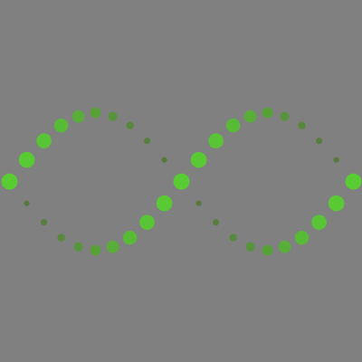
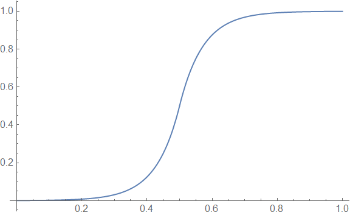
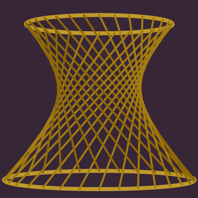
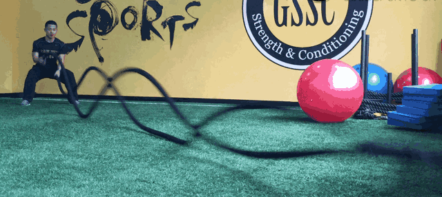
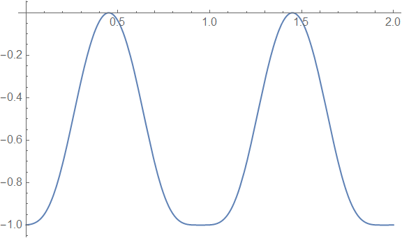
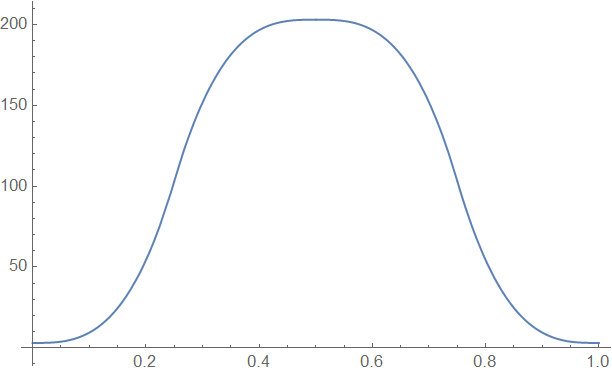
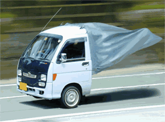

- **Mathematica 数学动图欣赏**是一个不定时更新的系列，这是第一期
- Mathematica ~~天生会画图~~天生会画好看的图，不用来画图岂不很可惜，所以就诞生了这个系列
- 这个系列的动图并不是我原创的，都是**收集于网络**，然后我尝试**用 Mathematica 复现**出来
- 有些动图，原作者提供了参数，所以基本可以完全复现。对于不知道参数的动图，只能大概复现一下
- 本期提供了 5 类 9 个动图，创意来自 Motus-Art

# 动图 1

入门级别，两条正弦曲线的相位相差 $\pi$，并且相位是时间 $t$ 的函数，控制点的大小、颜色等参数也按照正弦的规律变化即可。

# 动图 2

首先要保证所有矩形基本尺寸的轮廓包络是圆弧，在此基础上，控制矩形的高度按特定规律缩放即可。缩放规律是一个分段函数构成的平滑过渡曲线：
$$
f(t)=\left\{
\begin{array}{l}
 0 && t=0 \\
 0.5 \times 2^{10 (2 t-1)} && 0 \lt t \lt 0.5 \\
 1 - 0.5 \times 2^{-10 (2 t-1)} && 0.5\leq t \lt 1 \\
 1 && t=1 \\
\end{array}
\right.
$$
曲线长这个样子：

# 动图 3

让各线段的两个端点分别在上下两个圆周上来回移动就可以了（如果上下两个圆同等大小，那么这是一个单叶双曲面）

# 动图 4

上图有点像（只能说有点像）在地上甩绳子的感觉：

它的曲线是两个三角函数复合而成的，长下面的样子：

我试过让圆环按照正弦曲线上下振动，效果并不是很自然。

# 动图 5

Mathematica 也会转棍子了？看到这里，**六老师**再也按捺不住，直呼内行。

等等，看起来还很像台式机的风扇：

稍微修改一下参数，还可以衍生出下面的变种（~~统称为六老师快乐棍~~）

这些动画的关键之一是，怎样才能让棍子像是被甩出去那样，其实这里也有一个平滑过渡曲线：

$$
e(t)=\left\{
\begin{array}{l}
 4t^{3} && t \lt 0.5 \\
 4(t-1)^{3}+1 && 0.5 \lt t \lt 1 \\
\end{array}
\right.
$$
$$
f(t)=\left\{
\begin{array}{l}
 200e(2t)+3 && t \lt 0.5 \\
 200e(2-2t)+3 && 0.5 \lt t \lt 1 \\
\end{array}
\right.
$$

棍子的数量要按照 $f(t)$ 的规律变化：

# 源代码

关注青崖同学公众号，想获取哪个动图的源代码，就回复 **gif+序号**，比如 **gif1** 代表动图 1。示例：

# 结尾

**Mathematica 数学动图欣赏**系列会不定时持续更新，欢迎继续关注，下期见。

