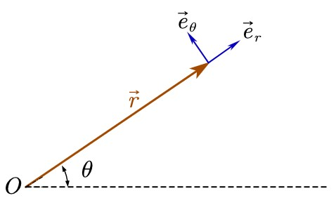
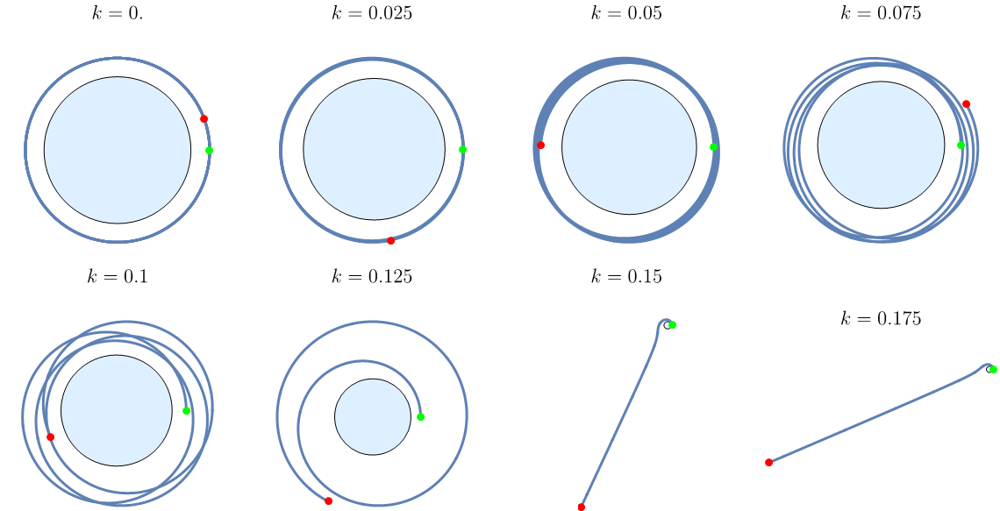
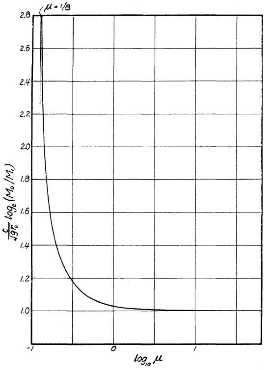
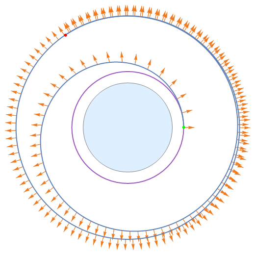
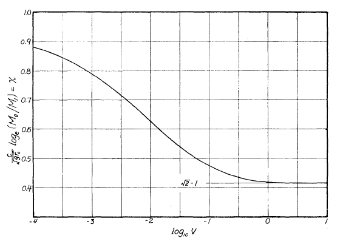
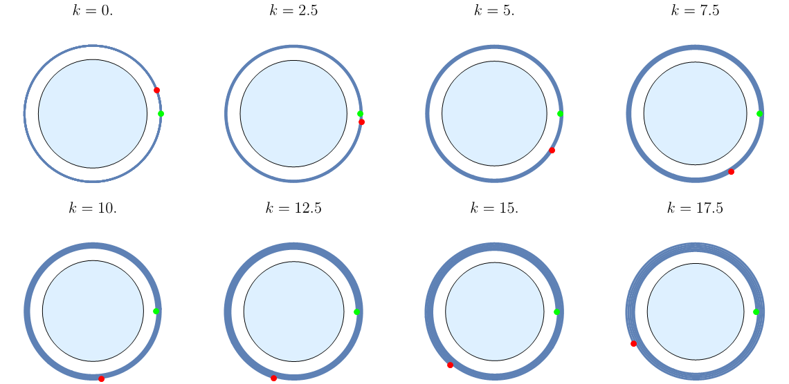

本文参考了钱学森的论文《Take-off from satellite orbit》和 Battin 的专著《An Introduction to the Mathematics and Methods of Astrodynamics》。

钱学森早在 1953 年就已经研究了**常值连续推力下航天器的运动**，时隔近七十年，很难再发现这个问题有何新颖之处，不过它所导出的一些数学结果是相当有趣的，而且基于这个问题，也能窥探出解决航天动力学问题所采用的一些解析方法。

# 极坐标形式的二体相对运动微分方程

已知二体问题的基本微分方程是
$$
\ddot{\vec{r}} = -\frac{\mu}{r^3}\vec{r}
$$

------

在下图中，定义了与航天器固联的一对正交单位向量 $\vec{e}_r$ 和 $\vec{e}_{\theta}$：

有如下关系
$$
\begin{aligned}
\vec{e}_r &= \cos \theta \vec{i} + \sin \theta \vec{j} \\
\vec{e}_{\theta} &= -\sin \theta \vec{i} + \cos \theta \vec{j}
\end{aligned}
$$
两式左右两边都对时间求导
$$
\begin{aligned}
\dot{\vec{e}}_r &= -\dot{\theta} \sin \theta \vec{i} +  \dot{\theta} \cos \theta \vec{j} =  \dot{\theta} \vec{e}_{\theta} \\
\dot{\vec{e}}_{\theta} &= - \dot{\theta} \cos \theta \vec{i} -  \dot{\theta} \sin \theta \vec{j} =  - \dot{\theta} \vec{e}_r
\end{aligned}
$$

------

由于
$$
\vec{r} = r \vec{e}_r
$$
故
$$
\begin{aligned}
\dot{\vec{r}} 
&= \dot{r} \vec{e}_r + r \dot{\vec{e}}_r \\
&= \dot{r} \vec{e}_r + r \dot{\theta} \vec{e}_{\theta}
\end{aligned}
$$

和
$$
\begin{aligned}
\ddot{\vec{r}} 
&= \ddot{r} \vec{e}_r + \dot{r} \dot{\vec{e}}_r + \dot{r} \dot{\theta} \vec{e}_{\theta} + r(\ddot{\theta} \vec{e}_{\theta} + \dot{\theta} \dot{\vec{e}}_r) \\
&= (\ddot{r} - r \dot{\theta}^2) \vec{e}_r + \frac{1}{r} \frac{d(r^2\dot{\theta})}{dt} \vec{e}_{\theta} \\
&= -\frac{\mu}{r^3} \vec{r} = -\frac{\mu}{r^2} \vec{e}_r
\end{aligned}
$$

观察上式，很容易得到极坐标形式的二体相对运动微分方程
$$
\begin{aligned}
\ddot{r} - r \dot{\theta}^2 &= -\frac{\mu}{r^2} \\
\frac{d(r^2\dot{\theta})}{dt} &= 0
\end{aligned}
$$

# 常值连续推力

本文不考虑常值连续推力的工程实际性，只以理想的模型来刻画问题。在下图中，从原点到航天器的方向为**径向**，与径向垂直的方向为**横向**。

下面将分别研究航天器在**径向**、**横向**的常值加速度作用下的运动。分别用 $a_{r}$、$a_{\theta}$ 表示径向、横向的加速度。

# 常值径向加速度

假设航天器初始位于半径为 $r_0$ 的圆轨道上，在 $t=t_0$ 时刻施加一个恒定的径向加速度 $a_{r}$，此时运动方程为
$$
\begin{aligned}
\ddot{r} - r \dot{\theta}^2 + \frac{\mu}{r^2} &= a_r \\
\frac{d(r^2\dot{\theta})}{dt} &= 0
\end{aligned}
$$
对第二个方程积分，并带入初始条件 $\left. \frac{d\theta}{dt} \right|_{t=t_0} = \sqrt{\mu / r_0^3}$，得
$$
r^2\dot{\theta} = \sqrt{\mu r_0}
$$
把 $\dot{\theta}$ 代入第一个方程，得
$$
\ddot{r} = \frac{\mu (r_0-r)}{r^3} + a_r
$$
观察到
$$
\ddot{r} = \frac{1}{2} \frac{2\dot{r}\ddot{r}}{\dot{r}} = \frac{1}{2} \frac{d\dot{r}^2}{dt}\frac{dt}{dr} = \frac{1}{2} \frac{d\dot{r}^2}{dr}
$$
结合以上两个式子，不难得到
$$
\dot{r}^2 = (r-r_0) \left[ 2a_r - \frac{\mu}{r_0r^2}(r-r_0) \right]
$$

------

航天器达到逃逸速度（抛物线速度）满足机械能为$0$：
$$
\frac{1}{2} \left[ \dot{r}^2 + (r\dot{\theta})^2 \right] - \frac{\mu}{r} = 0
$$
把相关的表达式代入，解出逃逸时的径向距离为
$$
r_{esc} = r_0 \left( 1 + \frac{\mu}{2 r_0^2 a_r} \right)
$$
进而把径向速度的平方改写为
$$
\dot{r}^2 = \frac{2a_r}{r^2} (r-r_0) \left[ r^2 - (r_{esc}-r_0)(r-r_0) \right]
$$
我们不希望在逃逸之前径向速度 $\dot{r}$ 等于 $0$，否则将逃逸失败。为此，要求二次方程 $r^2 - (r_{esc}-r_0)(r-r_0) = 0$ 无解，即判别式
$$
\Delta = \mu^2 - 8 a_r r_0^2 \mu < 0
$$
即
$$
a_r > \frac{\mu}{8r_0^2} = \frac{g_0}{8}
$$
这就是常值径向逃逸加速度所要满足的条件，其中 $g_0$ 为圆轨道上的引力加速度。而且，很自然地联想到引入系数 $k$，使得 $a_r = k g_0$，那么逃逸条件就是 $k > \frac{1}{8}$。

如果 $k \leq \frac{1}{8}$，说明航天器无法达到逃逸速度。此时，通过求解二次方程，得到
$$
r_{max} = \frac{1-\sqrt{1-8k}}{4k} r_0
$$

另外，根据前面 $\dot{r}^2$ 的表达式，易知 $r_{min}=r_0$。

------

相比七十年前，今天我们可以“作弊”——用数值方法把轨道积分出来。设置初始圆轨道的半径为 8000km，仿真时间 10 小时，系数 $k$ 分别取下图的 8 个数值，对应的轨道见下图：

没有达到逃逸条件时，航天器的轨道的确存在一个最大高度。

------

在钱学森的论文中，逃逸时间 $t_{esc} - t_0$ 是被计算出来了的，原理并不难，只需对
$$
\frac{ 1 }{ \sqrt{ (r-r_0) \left[ 2a_r - \frac{\mu}{r_0r^2}(r-r_0) \right] } } dr = dt
$$
两边积分。但是这个椭圆积分非常难算，感兴趣的读者可以参考 Battin 的专著。

------

假设 $c$ 为航天器的发动机的比冲，航天器的初始质量为 $M_0$，那么
$$
a_r M = k g_0 M = -c \frac{dM}{dt}
$$
即
$$
t-t_0 = \frac{c}{kg_0} \ln \frac{M_0}{M}
$$
把逃逸时间 $t_{esc} - t_0$ 代入，可得
$$
\frac{c}{\sqrt{g r_0}} \ln \frac{M_0}{M_{esc}} = 
\frac{2 \sqrt{k(k+1)}}{2 k+1} + \sqrt{2 k}
\left[ F\left(\frac{1}{\sqrt{8 k}}, \cos ^{-1} \frac{2 k-1}{2 k+1}\right)+E\left(\frac{1}{\sqrt{8 k}}, \cos ^{-1} \frac{2 k-1}{2 k+1}\right) \right]
$$
它的图像长下面的样子（这是论文里的原图。说实话，这个曲线我没有复现出来，但是我可以证明它的趋势是对的）

分析曲线的以下特征：

- 当 $k < \frac{1}{8}$ 时，根据之前的分析，存在某个径向距离 $r_{max}$，使得 $\dot{r}_{max} = 0$，但是此时 $\ddot{r} < 0$，航天器会向地球“跌落”。“跌落”到 $r_{min}$ 时，$\dot{r}_{min} = 0$，此时 $\ddot{r} > 0$，航天器再“上升”，然后再“跌落”。在这个重复的过程中，始终无法突破 $r_{max}$，航天器消耗了所有燃料，$M_{esc}=0$，即 $\frac{c}{\sqrt{g r_0}} \ln \frac{M_0}{M_{esc}}$ 无穷大。（一个疑问：航天器的质量包括干重和燃料质量，燃料消耗完之后 $M_{esc}$ 为什么会等于 $0$？不是还有干重吗？可能是认为航天器完全由燃料构成的，毕竟忽略了工程背景。如果航天器有干重，待燃料消耗完，推进加速度也消失了，那就是另一个故事了。）

- 当 $k = \frac{1}{8}$ 时，径向距离的最大值 $r_{max}=2r_0$。此时 $\ddot{r} = 0$，本质是因为推力和引力的合力正好等于向心力，可以简单验证一下：
$$
\begin{aligned}
合力 &= \frac{\mu}{r_{max}^2}-a_r = \frac{\mu}{(2r_0)^2}-\frac{1}{8}\frac{\mu}{r_0^2} = \frac{1}{8}\frac{\mu}{r_0^2} \\
向心力 &= \frac{(r\dot{\theta})^2}{r_{max}} = \frac{(\frac{\sqrt{\mu r_0}}{2r_0})^2}{2r_0} = \frac{1}{8}\frac{\mu}{r_0^2}
\end{aligned}
$$

推力全部用来维持圆周运动，再没有多余的能量用来增加航天器的总能量，所以航天器直到消耗完所有燃料也始终无法逃逸，即 $\frac{c}{\sqrt{g r_0}} \ln \frac{M_0}{M_{esc}}$ 无穷大。

- 当 $k \rightarrow \infty$时，推进加速度无穷大，意味着连续推力变成瞬时脉冲，而且是只增加径向速度的瞬时脉冲。按照开普勒轨道的相关理论，逃逸速度为 $\sqrt{2}v_0$。圆轨道的横向速度是 $v_0$，径向速度是 $0$，那么要求径向速度的改变量 $\Delta v = v_0$。事实上，$\Delta v = c \ln \frac{M_0}{M_{esc}}$ 且 $v_0 = \sqrt{g r_0}$，因此 $\frac{c}{\sqrt{g r_0}} \ln \frac{M_0}{M_{esc}} = \frac{\Delta v}{v_0} \rightarrow 1$。

# 常值横向加速度

假设航天器初始位于半径为 $r_0$ 的圆轨道上，在 $t=t_0$ 时刻施加一个恒定的横向加速度 $a_{\theta}$，此时运动方程为
$$
\begin{aligned}
\ddot{r} - r \dot{\theta}^2 &= - \frac{\mu}{r^2} \\
\frac{d(r^2\dot{\theta})}{dt} &= r a_{\theta}
\end{aligned}
$$
如果直接在第一个方程中导出 $\dot{\theta}$，并代入第二个方程，将得到一个三阶的微分方程。钱学森的论文中，在假设$r$只发生很小的变化的条件下，给出了这个三阶微分方程的级数解，这不在本文的讨论范围内。

------

对于很小的横向加速度 $a_{\theta}$，加速效果并不明显，径向加速度特别小，以至于 $\ddot{r} \approx 0$，即向心力几乎与引力平衡。根据这一假设：
$$
\dot{\theta} = \sqrt{\mu / r^3}
$$
代入运动方程的第二个式子，得
$$
\sqrt{\mu} \frac{ dr^{\frac{1}{2}} }{dt} = r a_{\theta}
$$
即
$$
\frac{1}{2} \sqrt{\mu} r^{-\frac{3}{2}} dr = a_{\theta} dt
$$
两边积分，并带入初始条件，得径向距离与时间的关系：
$$
r = r_0 \left[ 1 - \frac{(t-t_0)a_{\theta}}{v_0} \right]^{-2}
$$
进而
$$
\begin{aligned}
\dot{r} &= 2 r_0 \frac{a_{\theta}}{v_0} \left[ 1 - \frac{(t-t_0)a_{\theta}}{v_0} \right]^{-3} = 2 r_0 \frac{a_{\theta}}{v_0} \left( \frac{r}{r_0} \right)^{\frac{3}{2}} \\
\ddot{r} &= 6 r_0 \frac{a_{\theta}^2}{v_0^2} \left[ 1 - \frac{(t-t_0)a_{\theta}}{v_0} \right]^{-4} = 6 r_0 \frac{a_{\theta}^2}{v_0^2} \left( \frac{r}{r_0} \right)^{2}
\end{aligned}
$$
根据运动方程的第一个式子，并根据$\ddot{r}$很小的假设条件，得
$$
(r\dot{\theta})^2 = \frac{\mu}{r}
$$
把相关的表达式代入逃逸条件 $\frac{1}{2} \left[ \dot{r}^2 + (r\dot{\theta})^2 \right] - \frac{\mu}{r} = 0$，得
$$
r_{esc} = \frac{ r_0 v_0 }{ \sqrt{2 r_0 a_{\theta}} }
$$
根据径向距离与时间的关系，得到逃逸时间为：
$$
t_{esc}-t_0 = \frac{v_0}{a_{\theta}} \left[ 1 - \left( \frac{2a_{\theta}r_0}{v_0^2} \right)^{\frac{1}{4}} \right]
$$

------

根据
$$
a_{\theta} M = -c \dot{M}
$$
得
$$
t_{esc}-t_0 = \frac{c}{a_{\theta}} \ln \frac{M_0}{M_{esc}}
$$
整理一下
$$
\frac{c}{\sqrt{g r_0}} \ln \frac{M_0}{M_{esc}} = 1 - \left( 2 k \right)^{\frac{1}{4}}
$$
画出图像

但请不要忘记我们的假设条件：**径向加速度很小**。在 $k$ 比较小时，这个曲线比较符合真实情况。但是，**在$k$较大时，还是应该基于原始的三阶微分方程进行分析**，正确的曲线如下图（这还是论文里的原图。这个曲线我也没有复现出来，但是我也可以证明它的趋势是对的）

分析曲线的两个特征：

- 当 $k \rightarrow 0$ 时，“径向加速度特别小”这一假设条件是成立的，根据我们导出的 $\frac{c}{\sqrt{g r_0}} \ln \frac{M_0}{M_{esc}} = 1 - \left( 2 k \right)^{\frac{1}{4}}$，可以得到 $\frac{c}{\sqrt{g r_0}} \ln \frac{M_0}{M_{esc}} \rightarrow 1$。
- 当 $k \rightarrow \infty$ 时，与常值径向推力同理，推进加速度无穷大，意味着连续推力变成瞬时脉冲，而且是只增加横向速度的瞬时脉冲。按照开普勒轨道的相关理论，逃逸速度为 $\sqrt{2}v_0$。圆轨道的横向速度是 $v_0$，那么要求横向速度的改变量 $\Delta v = (\sqrt{2}-1) v_0$。再根据 $\Delta v = c \ln \frac{M_0}{M_{esc}}$ 且$v_0 = \sqrt{g r_0}$，得到 $\frac{c}{\sqrt{g r_0}} \ln \frac{M_0}{M_{esc}} = \frac{\Delta v}{v_0} \rightarrow \sqrt{2}-1$。

------

用数值方法把轨道计算出来，仿真条件不变，系数 $k$ 分别取下图的 8 个数值，对应的轨道见下图：

# 结尾

我个人觉得钱学森的这篇论文的思想很深刻（否则也不会被 Battin 选入教材），处理问题的很多技巧值得学习。
