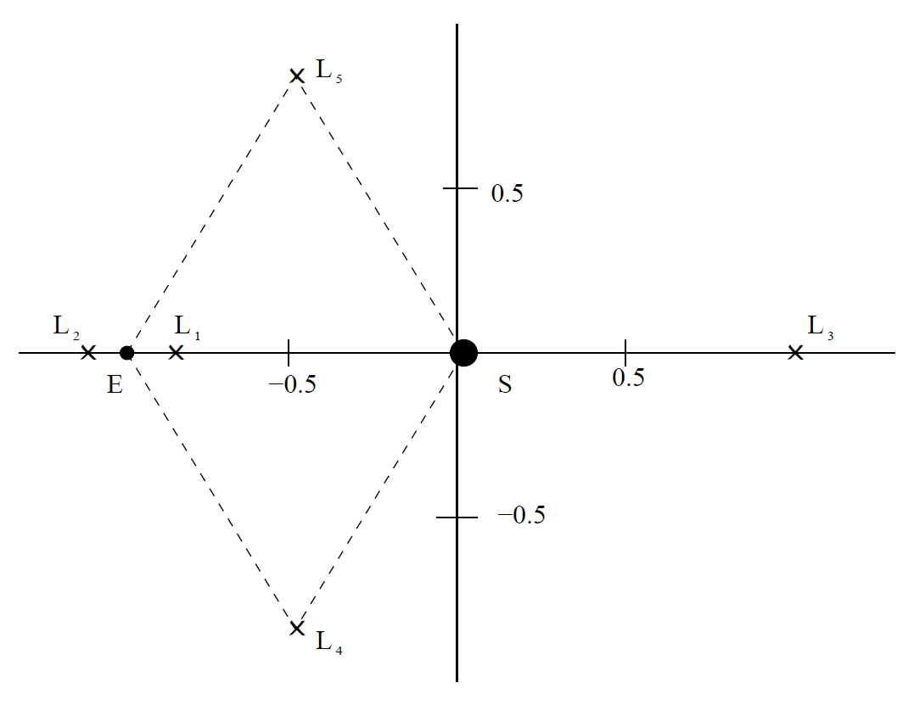
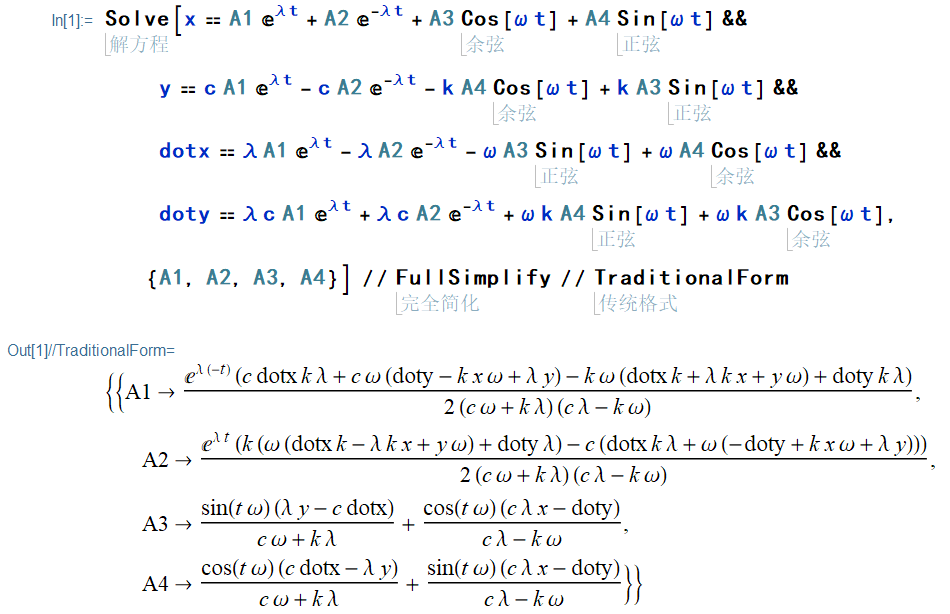
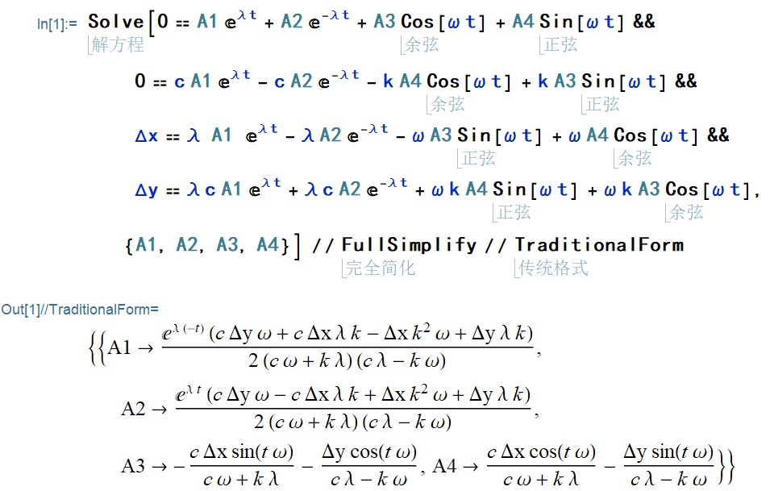
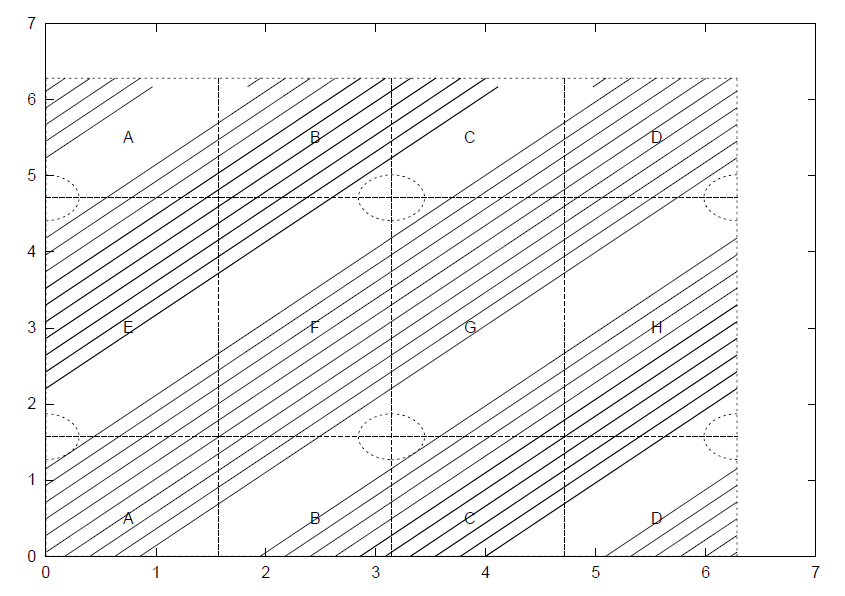
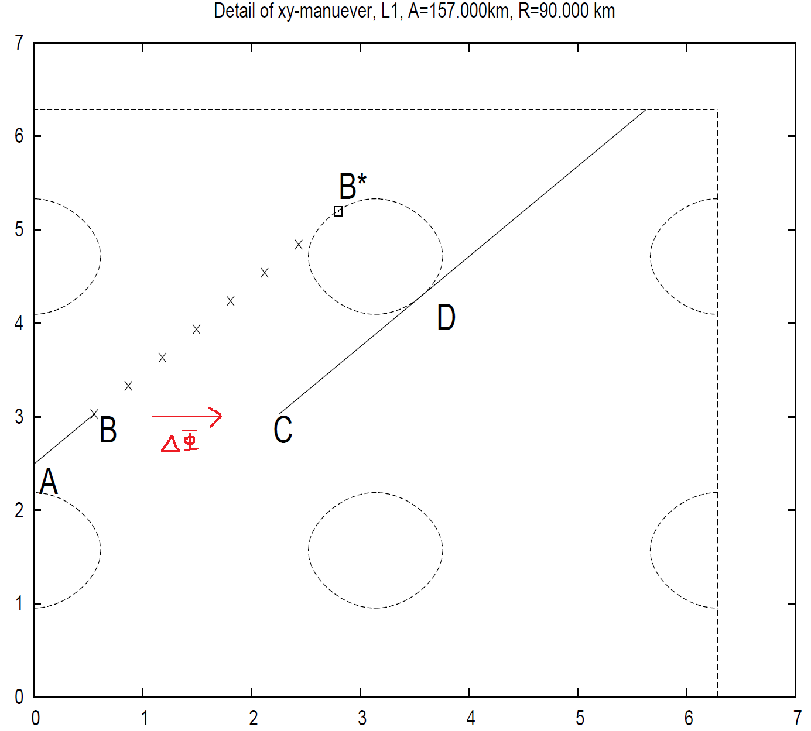
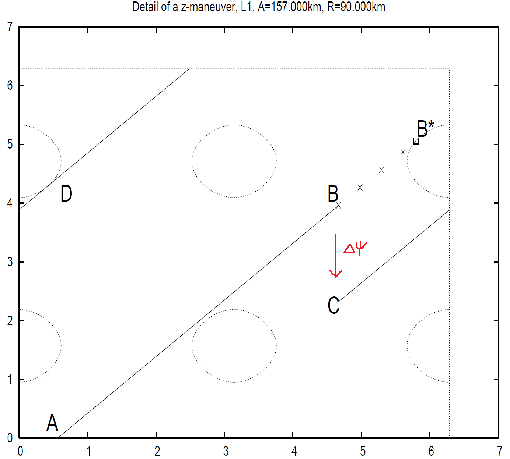

最近阅读了一篇介绍 Lissajous 轨道借助不变流形来规避日食的论文，《Eclipse Avoidance for Lissajous Orbits Using Invariant Manifolds》，虽然是 2004 年发表的，但是思路巧妙、方法可行、结果完整。原文涉及到繁琐的数学推导，不过推导过程被作者写的很省略，往往用一句 after some cumbersome algebra 带过，所以读起来是很吃力的。那么这篇笔记就是详细地还原一下那些 cumbersome algebra，供以后参考。

# 圆型限制性三体问题

动力学方程：
$$
\begin{aligned}
\ddot{X} - 2\dot{Y} &= \frac{ \partial \Omega }{ \partial X }\\
\ddot{Y} + 2\dot{X} &= \frac{ \partial\Omega }{ \partial Y }\\
\ddot{Z} &= \frac{ \partial \Omega }{ \partial Z }
\end{aligned}
$$
其中，$\Omega(X,Y,Z) = \frac{1}{2}(X^2+Y^2) + \frac{1-\mu}{r_1} + \frac{\mu}{r_2} + \frac{1}{2}\mu(1-\mu)$，$r_{1}^{2} = (X-\mu)^2+Y^2+Z^2$，$r_{2}^{2} = (X+1-\mu)^2+Y^2+Z^2$。

圆型限制性三体问题有 5 个平动点。其中 3 个在 $X$ 轴上，称为共线平动点。另外 2 个称为三角平动点。

这里只关注这 3 个共线平动点，它们分别满足：
$$
Y = Z = 0
$$
$$
\begin{cases}
X - \frac{1-\mu}{(X+\mu)^{2}} + \frac{\mu}{(X-1+\mu)^{2}}=0 & ,\quad -\mu < X < 1-\mu \\
X - \frac{1-\mu}{(X+\mu)^{2}} - \frac{\mu}{(X-1+\mu)^{2}}=0 & ,\quad X > 1-\mu \\
X + \frac{1-\mu}{(X+\mu)^{2}} + \frac{\mu}{(X-1+\mu)^{2}}=0 & ,\quad X < -\mu
\end{cases}
$$
# 共线平动点附近运动的线性化

记航天器的位置矢量 $\vec{r} = (X,Y,Z)^T$，平动点的位置为 $\vec{r}_e$，那么航天器相对平动点的位置矢量 $\vec{\rho} = \vec{r} - \vec{r}_e = (x,y,z)^T$，更进一步有：
$$
\dot{\vec{\rho}} = \dot{\vec{r}} - \dot{\vec{r}}_e = \dot{\vec{r}}\\
\ddot{\vec{\rho}} = \ddot{\vec{r}} - \ddot{\vec{r}}_e = \ddot{\vec{r}}
$$
为了方便书写，给出矢量形式的动力学方程：
$$
\ddot{\vec{r}} + \begin{pmatrix} -2\dot{Y}\\ 2\dot{X} \\0 \end{pmatrix} = \frac{ \partial \Omega }{ \partial \vec{r} }
$$
而
$$
\frac{ \partial }{ \partial \vec{r} }
= \frac{ \partial \vec{\rho}^T }{ \partial \vec{r} } \frac{ \partial }{ \partial \vec{\rho} }
= \frac{ \partial (\vec{r}^T-\vec{r}_e^T) }{ \partial \vec{r} } \frac{ \partial }{ \partial \vec{\rho} }
= \mathbf{I}_{3\times3} \frac{ \partial }{ \partial \vec{\rho} }
= \frac{ \partial }{ \partial \vec{\rho} }
$$
所以充分利用上述几个 $\vec{r}$ 与 $\vec{\rho}$ 的关系，可以得到关于 $\vec{\rho}$ 的动力学方程：
$$
\ddot{\vec{\rho}} + \begin{pmatrix} -2\dot{y}\\ 2\dot{x} \\0 \end{pmatrix} = \frac{ \partial \Omega }{ \partial \vec{\rho} }
$$

------

平动点对应的 $\vec{\rho}_e = \vec{0}$，接下来对上式在 $\vec{\rho}_e$ 附近做线性化处理。对上式的非线性项在 $\vec{\rho}_e$ 处 Taylor 展开，得到
$$
\ddot{\vec{\rho}} + \begin{pmatrix} -2\dot{y}\\ 2\dot{x} \\0 \end{pmatrix} = \vec{\rho}_e + \frac{ \partial^2 \Omega }{ \partial \vec{\rho}_e^2 } \vec{\rho} + O(\vec{\rho}^2)
$$
由于研究平动点附近的运动，所以 $\vec{\rho}$ 是小量，故二阶及二阶以上的量 $O(\vec{\rho}^2)$ 也是小量，可以忽略。

另外，由于
$$
\frac{ \partial }{ \partial \vec{r} } = \frac{ \partial }{ \partial \vec{\rho} }
\quad \Rightarrow \quad
\frac{ \partial }{ \partial \vec{r} } \left( \frac{ \partial }{ \partial \vec{r} } \right) = \frac{ \partial }{ \partial \vec{\rho} } \left( \frac{ \partial }{ \partial \vec{\rho} } \right)
\quad \Rightarrow \quad
\frac{ \partial^2 }{ \partial \vec{r}^2 } = \frac{ \partial^2 }{ \partial \vec{\rho}^2 }
$$
因此
$$
\frac{ \partial^2 \Omega }{ \partial \vec{\rho}_e^2 } = \frac{ \partial^2 \Omega }{ \partial \vec{r}_e^2 }
$$
经过以上处理，得到了在 $\vec{\rho}_e$ 附近的线性微分方程：
$$
\ddot{\vec{\rho}} + \begin{pmatrix} -2\dot{y}\\ 2\dot{x} \\0 \end{pmatrix} = \frac{ \partial^2 \Omega }{ \partial \vec{r}_e^2 } \vec{\rho}
$$

------

把 $\frac{ \partial^2 \Omega }{ \partial \vec{r}^2 }$ 写成分量的形式：
$$
\frac{ \partial^2 \Omega }{ \partial \vec{r}^2 }
= \begin{bmatrix}
\Omega_{XX} & \Omega_{XY} & \Omega_{XZ} \\
\Omega_{YX} & \Omega_{YY} & \Omega_{YZ} \\
\Omega_{ZX} & \Omega_{ZY} & \Omega_{ZZ} \\
\end{bmatrix}
$$
其中，$\Omega_{XY} = \Omega_{YX}$，$\Omega_{X Z}=\Omega_{Z X}$，$\Omega_{Y Z}=\Omega_{Z Y}$。根据 $\Omega$ 的表达式，可以计算出各偏导数的具体形式：

$$
\begin{aligned}
\Omega_{XX} &= 1 - \frac{1-\mu}{r_{1}^{3}} - \frac{\mu}{r_{2}^{3}} + \frac{3(1-\mu)(X+\mu)^{2}}{r_{1}^{5}} + \frac{3 \mu(X-1+\mu)^{2}}{r_{2}^{5}} \\
\Omega_{YY} &= 1 - \frac{1-\mu}{r_{1}^{3}} - \frac{\mu}{r_{2}^{3}} + \frac{3(1-\mu) Y^{2}}{r_{1}^{5}} + \frac{3 \mu Y^{2}}{r_{2}^{5}} \\
\Omega_{ZZ} &= - \frac{1-\mu}{r_{1}^{3}} - \frac{\mu}{r_{2}^{3}} + \frac{3(1-\mu) Z^{2}}{r_{1}^{5}} + \frac{3 \mu Z^{2}}{r_{2}^{5}} \\
\Omega_{XY} &= \frac{3(1-\mu)(X+\mu) Y}{r_{1}^{5}} + \frac{3 \mu(X-1+\mu) Y}{r_{1}^{5}} \\
\Omega_{XZ} &= \frac{3(1-\mu)(X+\mu) Z}{r_{1}^{5}} + \frac{3 \mu(X-1+\mu) Z}{r_{1}^{5}} \\
\Omega_{YZ} &= \frac{3(1-\mu) Y Z}{r_{1}^{5}} + \frac{3 \mu Y Z}{r_{1}^{5}}
\end{aligned}
$$
把共线平动点满足的条件代入，得到
$$
\begin{aligned}
& \Omega_{XY,e} = \Omega_{XZ,e} = \Omega_{YZ,e} = 0 \\
& \Omega_{XX,e} = 1 + 2c_2 \\
& \Omega_{YY,e} = 1 - c_2 \\
& \Omega_{ZZ,e} = - c_2
\end{aligned}
$$
这里 $c_2 = \frac{1-\mu}{r_{1,e}^3} + \frac{\mu}{r_{2,e}^3}$ 是常数。把上式代回到线性微分方程，得到共线平动点附近运动的线性微分方程的分量形式：

$$
\begin{array}{r}
\ddot{x} - 2 \dot{y} - (1 + 2 c_{2}) x = 0 \\
\ddot{y} + 2 \dot{x} + (c_{2} - 1) y = 0 \\
\ddot{z} + c_{2} z = 0
\end{array}
$$

# 线性化方程的求解

观察线性微分方程，很显然，$x$ 和 $y$ 方向的运动耦合，$z$ 方向的运动是解耦的。

## $xy$ 方向的特征值

$xy$ 方向的特征方程
$$
\begin{vmatrix}
d^2 - (1+2c_2) & -2d \\
2d & d^2 + (c_2-1)
\end{vmatrix} = 0
$$
即
$$
d^4 + (2-c_2)d^2 - (1+2c_2)(c_2-1) = 0
$$
方程有 4 个解
$$
\pm \sqrt{ \frac{ c_2-2 \pm \sqrt{9c_2^2-8c_2} }{ 2 } }
$$

因此，$xy$ 方向的两对特征值分别为 $\pm \lambda$，$\pm \omega i$，其中
$$
\begin{aligned}
\lambda &= \sqrt{ \frac{ c_2-2 + \sqrt{9c_2^2-8c_2} }{ 2 } } \\
\omega &= \sqrt{ \frac{ 2-c_2 + \sqrt{9c_2^2-8c_2} }{ 2 } }
\end{aligned}
$$

## $z$ 方向的特征值

$z$ 方向的特征方程
$$
d^2 + c_2 = 0
$$
方程有 2 个解
$$
\pm \sqrt{c_2} i
$$

因此，$z$ 方向的一对特征值为 $\pm \nu i$，其中 $\nu = \sqrt{c_2}$。

## 解的构造

根据常微分方程解的理论，可以把 $x(t)$ 和 $z(t)$ 构造成
$$
\begin{aligned}
x(t) &= A_{1} e^{\lambda t} + A_{2} e^{-\lambda t} + A_{3} \cos \omega t + A_{4} \sin \omega t \\
z(t) &= A_{5} \cos \nu t + A_{6} \sin \nu t
\end{aligned}
$$
其中 $A_i$ 是任意常数。把 $x(t)$ 代入线性微分方程的第一项，得到
$$
\begin{aligned}
&2 \dot{y}(t) = (\lambda^2-1-2c_2) A_{1} e^{\lambda t} + (\lambda^2-1-2c_2) A_{2} e^{-\lambda t} \\
& - (\omega^2+1+2c_2) A_{3} \cos \omega t - (\omega^2+1+2c_2) A_{4} \sin \omega t
\end{aligned}
$$
解得
$$
\begin{aligned}
&y(t) = \frac{ \lambda^2-1-2c_2 }{ 2\lambda } A_{1} e^{\lambda t} - \frac{ \lambda^2-1-2c_2 }{ 2\lambda } A_{2} e^{-\lambda t} \\
& - \frac{ -(\omega^2+1+2c_2) }{ 2\omega } A_{4} \cos \omega t + \frac{ -(\omega^2+1+2c_2) }{ 2\omega } A_{3} \sin \omega t
\end{aligned}
$$
记
$$
\begin{aligned}
c &= \frac{ \lambda^2-1-2c_2 }{ 2\lambda } \\
\bar{k} &= \frac{ -(\omega^2+1+2c_2) }{ 2\omega }
\end{aligned}
$$
则
$$
y(t)=c A_{1} e^{\lambda t} - c A_{2} e^{-\lambda t} - \bar{k} A_{4} \cos \omega t + \bar{k} A_{3} \sin \omega t
$$

求解完毕。

## 解的变形

把三角函数的项合并：
$$
\begin{aligned}
&x(t) = A_{1} e^{\lambda t} + A_{2} e^{-\lambda t} + A_{x} \cos (\omega t+\phi) \\
&y(t) = c A_{1} e^{\lambda t} - c A_{2} e^{-\lambda t} + \bar{k} A_{x} \sin (\omega t+\phi) \\
&z(t) = A_{z} \cos (\nu t+\psi)
\end{aligned}
$$

其中
$$
\begin{aligned}
A_3 = A_x \cos \phi \quad&,\quad A_4 = -A_x \sin \phi \\
A_5 = A_z \cos \psi \quad&,\quad A_6 = -A_z \sin \psi
\end{aligned}
$$

# Lissajous 轨道

选择 $A_1 = A_2 = 0$，得到 Lissajous 轨道：
$$
\begin{aligned}
&x(t) = A_{x} \cos (\omega t+\phi) \\
&y(t) = \bar{k} A_{x} \sin (\omega t+\phi) \\
&z(t) = A_{z} \cos (\nu t+\psi)
\end{aligned}
$$

三维轨迹如下

# 施加 $z$ 方向脉冲

因为 $z$ 方向的运动简单，故先行介绍。在时刻 $t_m$ 施加 $z$ 方向的速度脉冲 $\Delta \dot{z}$。认为脉冲是瞬间完成的，不改变位置，即 $z(t_m^-) = z(t_m^+)$。

## 脉冲对振幅的影响

记施加脉冲前的振幅为 $A_{5}^{(i)}$ 和 $A_{6}^{(i)}$，施加脉冲后变为 $A_{5}^{(f)}$ 和 $A_{6}^{(f)}$。那么
$$
\begin{aligned}
z(t_m^-) &= A_{5}^{(i)} \cos \nu t_m + A_{6}^{(i)} \sin \nu t_m \\
z(t_m^+) &= A_{5}^{(f)} \cos \nu t_m + A_{6}^{(f)} \sin \nu t_m \\\\
\dot{z}(t_m^-) &= -\nu A_{5}^{(i)} \sin \nu t_m + \nu A_{6}^{(i)} \cos \nu t_m \\
\dot{z}(t_m^-) + \Delta \dot{z} &= -\nu A_{5}^{(f)} \sin \nu t_m + \nu A_{6}^{(f)} \cos \nu t_m
\end{aligned}
$$
作差，得到
$$
\begin{aligned}
0 &= \left( A_{5}^{(f)} - A_{5}^{(i)} \right) \cos \nu t_m + \left( A_{6}^{(f)} - A_{6}^{(i)} \right) \sin \nu t_m \\
\frac{ \Delta \dot{z} }{ \nu } &= -\left( A_{5}^{(f)} - A_{5}^{(i)} \right) \sin \nu t_m + \left( A_{6}^{(f)} - A_{6}^{(i)} \right) \cos \nu t_m
\end{aligned}
$$
解得
$$
\begin{aligned}
A_{5}^{(f)} &= A_{5}^{(i)} - \frac{ \Delta \dot{z} }{ \nu } \sin \nu t_m \\
A_{6}^{(f)} &= A_{6}^{(i)} + \frac{ \Delta \dot{z} }{ \nu } \cos \nu t_m
\end{aligned}
$$
故施加脉冲后 $z$ 方向振幅为：
$$
\begin{aligned}
{ A_{z}^{(f)} }^2 &= { A_{5}^{(f)} }^2 + { A_{6}^{(f)} }^2 \\
&= { A_{z}^{(i)} }^2 + \frac{ 2 \dot{z}(t_m^-)\Delta \dot{z} }{ \nu } + \frac{ (\Delta \dot{z})^2 }{ \nu^2 } \\
&= { A_{z}^{(i)} }^2 - \frac{ 2 \Delta \dot{z} }{ \nu } A_{z}^{(i)} \sin(\nu t_m + \psi_i) + \frac{ (\Delta \dot{z})^2 }{ \nu^2 }
\end{aligned}
$$
据此，可以解出 $\Delta \dot{z}$ 满足的条件：

$$
\frac{\Delta \dot{z}}{\nu} = A_{z}^{(i)} \sin (\nu t_{m}+\psi_{i}) \pm \sqrt{ {A_{z}^{(f)}}^2 - {A_{z}^{(i)}}^{2} \cos^{2} (\nu t_{m}+\psi_{i}) }
$$

## 保持振幅不变

下面考虑施加脉冲却不改变振幅的情况，即 $A_{z}^{(i)} = A_{z}^{(f)} = A_{z}$，代入上式，得到
$$
\frac{ \Delta \dot{z} }{ \nu } = 2 A_{z} \sin(\nu t_m + \psi_i) \quad \text{or} \quad 0
$$
第二个解相当于没有脉冲，振幅当然不会改变，所以舍掉。

## 振幅不变时相位如何改变

把振幅不变的条件代入 $A_{5}^{(f)}$ 和 $A_{6}^{(f)}$ 的表达式
$$
\begin{aligned}
A_{5}^{(f)} &= A_{5}^{(i)} - \frac{ \Delta \dot{z} }{ \nu } \sin \nu t_m \\
&= A_{z} \cos \psi_i - 2 A_{z} \sin(\nu t_m + \psi_i) \sin \nu t_m \\
&= A_{z} \cos (2 \nu t_m + \psi_i) \\
&= A_{z} \cos \psi_f \\\\
A_{6}^{(f)} &= A_{6}^{(i)} + \frac{ \Delta \dot{z} }{ \nu } \cos \nu t_m \\
&= A_{z} \sin \psi_i + 2 A_{z} \sin(\nu t_m + \psi_i) \cos \nu t_m \\
&= A_{z} \sin (2 \nu t_m + \psi_i) \\
&= -A_{z} \sin \psi_f
\end{aligned}
$$

通过对比，可以发现
$$
\psi_f = -2 \nu t_m - \psi_i \mod 2\pi
$$
或者
$$
\psi_f - \psi_i = -2( \nu t_m + \psi_i) \mod 2\pi
$$

这意味着：**只要设定好相位改变量，就可以确定何时施加脉冲，进而又可以把脉冲的大小确定出来**。这就是规避日食的原理。

# 施加 $xy$ 平面内脉冲

在时刻 $t_m$ 施加 $xy$ 平面内的速度脉冲 $(\Delta \dot{x},\Delta \dot{y})$。

## 脉冲对振幅的影响

联立求解
$$
\begin{aligned}
x(t_m) &= A_{1}^{(f)} e^{\lambda t_m} + A_{2}^{(f)} e^{-\lambda t_m} + A_{3}^{(f)} \cos \omega t_m + A_{4}^{(f)} \sin \omega t_m \\
y(t_m) &= c A_{1}^{(f)} e^{\lambda t_m} - c A_{2}^{(f)} e^{-\lambda t_m} - \bar{k} A_{4}^{(f)} \cos \omega t_m + \bar{k} A_{3}^{(f)} \sin \omega t_m \\
\dot{x}(t_m^-) + \Delta \dot{x} &= \lambda A_{1}^{(f)} e^{\lambda t_m} - \lambda A_{2}^{(f)} e^{-\lambda t_m} - \omega A_{3}^{(f)} \sin \omega t_m + \omega A_{4}^{(f)} \cos \omega t_m \\
\dot{y}(t_m^-) + \Delta \dot{y} &= c \lambda A_{1}^{(f)} e^{\lambda t_m} + c \lambda A_{2}^{(f)} e^{-\lambda t_m} + \bar{k} \omega A_{3}^{(f)} \sin \omega t_m + \bar{k} \omega A_{4}^{(f)} \cos \omega t_m
\end{aligned}
$$
太复杂了，借助 Mathematica 求解：

整理一下
$$
\begin{aligned}
A_{3}^{(f)} = \frac{ c \lambda x(t_m) - (\dot{y}(t_m^-) + \Delta \dot{y}) }{ d_1 } \cos \omega t_m + \frac{ \lambda y(t_m) - c (\dot{x}(t_m^-) + \Delta \dot{x}) }{ d_2 } \sin \omega t_m \\
A_{4}^{(f)} = \frac{ c \lambda x(t_m) - (\dot{y}(t_m^-) + \Delta \dot{y}) }{ d_1 } \sin \omega t_m + \frac{ \lambda y(t_m) - c (\dot{x}(t_m^-) + \Delta \dot{x}) }{ d_2 } \cos \omega t_m
\end{aligned}
$$
记
$$
d_{1} = c \lambda - \bar{k} \omega \\
d_{2} = c \omega + \bar{k} \lambda
$$
因为施加脉冲之前，航天器在 Lissajous 轨道上，因此对于 $t \leq t_m$ 有
$$
\begin{aligned}
x(t)=A_{x}^{(i)} \cos (\omega t+\phi) \quad&,\quad \dot{x}(t)=-A_{x}^{(i)} \omega \sin (\omega t+\phi) \\
y(t)=\bar{k} A_{x}^{(i)} \sin (\omega t+\phi) \quad&,\quad \dot{y}(t)=\bar{k} A_{x}^{(i)} \omega \cos (\omega t+\phi)
\end{aligned}
$$
那么以下几个关系成立
$$
\dot{x} = \frac{-\omega}{\bar{k}} y \\
\dot{y} = \bar{k} \omega x \\
{ A_{x}^{(i)} }^{2} = x^{2} + \frac{ y^{2} }{ \bar{k}^{2} }
$$
进一步
$$
c \lambda x - \dot{y} = c \lambda x - \bar{k} \omega x = (c \lambda - \bar{k} \omega) x = d_1 x \\
\lambda y - c \dot{x} = \lambda y + c \frac{\omega}{k} y = \left( \lambda + c \frac{\omega}{\bar{k}} \right)y = \frac{d_2}{\bar{k}} y
$$
则
$$
\begin{aligned}
{ A_{x}^{(f)} }^2 &= { A_{3}^{(f)} }^2 + { A_{4}^{(f)} }^2 \\
&= \frac{ \left( (\dot{y}(t_m^-) + \Delta \dot{y}) - c \lambda x(t_m) \right)^2 }{ d_{1}^{2} } + \frac{ \left( c (\dot{x}(t_m^-) + \Delta \dot{x}) - \lambda y(t_m) \right)^2 }{ d_{2}^{2} } \\
&= { A_{x}^{(i)} }^2 + \frac{ (\Delta \dot{y})^{2} - 2c \lambda x(t_m) \Delta \dot{y} + 2 \dot{y}(t_m^-) \Delta \dot{y} }{ d_{1}^{2} } + \frac{ (c \Delta \dot{x})^{2} - 2c \lambda y(t_m) \Delta \dot{x} + 2c^2 \dot{x}(t_m^-) \Delta \dot{x} }{ d_{2}^{2} } \\
&= x(t_m)^2 + \frac{ y(t_m)^2 }{ \bar{k}^2 } + \frac{ (\Delta \dot{y})^{2} - 2 \Delta \dot{y} \left( c \lambda x(t_m) - \dot{y}(t_m^-) \right) }{ d_{1}^{2} } + \frac{ (c \Delta \dot{x})^{2} - 2c \Delta \dot{x} \left( \lambda y(t_m) - c \dot{x}(t_m^-) \right) }{ d_{2}^{2} } \\
&= \frac{ (\Delta \dot{y})^{2} - 2 \Delta \dot{y} d_1 x(t_m) + (d_1 x(t_m))^2 }{ d_{1}^{2} } + \frac{ (c \Delta \dot{x})^{2} - 2c \Delta \dot{x} \frac{d_2}{\bar{k}} y(t_m) + (d_2 \frac{ y(t_m) }{ \bar{k} })^2 }{ d_{2}^{2} } \\
&= \left( \frac{ \Delta \dot{y} - d_1 x(t_m) }{ d_1 } \right)^2 + \left( \frac{ c \Delta \dot{x} - \frac{d_2}{\bar{k}} y(t_m) }{ d_2 } \right)^2
\end{aligned}
$$

上式定量地确定了脉冲 $(\Delta \dot{x},\Delta \dot{y})$ 对振幅 $A_{x}^{(f)}$ 的影响。

## 稳定流形

$A_1$ 是不稳定运动方向的系数，令 $A_1 = 0$
$$
\begin{aligned}
x(t) &= A_{2} e^{-\lambda t} + A_{3} \cos \omega t + A_{4} \sin \omega t \\
y(t) &= - c A_{2} e^{-\lambda t} - \bar{k} A_{4} \cos \omega t + \bar{k} A_{3} \sin \omega t \\
\dot{x}(t) &= -\lambda A_{2} e^{-\lambda t} - A_{3} \omega \sin \omega t + A_{4} \omega \cos \omega t \\
\dot{y}(t) &= c \lambda A_{2} e^{-\lambda t} + \bar{k} \omega A_{4} \sin \omega t + \bar{k} A_{3} \omega \cos \omega t
\end{aligned}
$$
考虑到
$$
\dot{y} - \bar{k} \omega x = ( c \lambda - \bar{k} \omega ) A_{2} e^{-\lambda t} = d_1 e^{-\lambda t} \\
\omega y + \bar{k} \dot{x} = -( c \omega + \bar{k} \lambda ) A_{2} e^{-\lambda t} = -d_2 e^{-\lambda t}
$$
因此
$$
\frac{\dot{y} - \bar{k} \omega x}{d_1} = - \frac{\omega y + \bar{k} \dot{x}}{d_2}
$$
变形为
$$
\frac{\bar{k}}{d_{2}} \dot{x} + \frac{1}{d_{1}} \dot{y} = \frac{\bar{k} \omega}{d_{1}} x - \frac{\omega}{d_{2}} y
$$
这是由不稳定运动方向的系数 $A_1 = 0$ 所导出的推论，它把运动的自由度减小了 1。

------

另外，施加脉冲后，如果想要保持上述条件，即
$$
\frac{\bar{k}}{d_{2}} (\dot{x} + \Delta \dot{x} ) + \frac{1}{d_{1}} (\dot{y} + \Delta \dot{y} ) = \frac{\bar{k} \omega}{d_{1}} x - \frac{\omega}{d_{2}} y
$$
那么必须使得下式成立：
$$
\frac{\bar{k}}{d_{2}} \Delta \dot{x} + \frac{1}{d_{1}} \Delta \dot{y} = 0
$$
这说明 $(\Delta \dot{x},\Delta \dot{y})$ 和 $( \frac{\bar{k}}{d_{2}} , \frac{1}{d_{1}} )$ 正交，可以构造成：
$$
\begin{aligned}
(\Delta \dot{x}, \Delta \dot{y}) &= a\left(\frac{1}{d_{1}}, \frac{-\bar{k}}{d_{2}}\right) \\
&= \frac{\alpha}{\sqrt{c^{2}+\bar{k}^{2}}}\left(d_{2},-\bar{k} d_{1}\right)
\end{aligned}
$$

因为 $\left( \frac{d_{2}}{\sqrt{c^{2}+\bar{k}^{2}}} , \frac{-\bar{k} d_{1}}{\sqrt{c^{2}+\bar{k}^{2}}} \right)$ 是单位向量，所以 $\alpha$ 表示脉冲的大小，另外还可以发现脉冲的方向始终是固定的。

## 稳定流形情况下脉冲对振幅的影响

把上述 $(\Delta \dot{x},\Delta \dot{y})$ 的表达式代入 ${ A_{x}^{(f)} }^{2}$ 的表达式：

$$
\begin{aligned}
{ A_{x}^{(f)} }^{2} &= \alpha^{2} + \frac{ 2 \alpha }{ \sqrt{c^{2}+\bar{k}^{2}} } \left( \frac{-c}{\bar{k}} y(t_m)+\bar{k} x(t_m)\right) + { A_{x}^{(i)} }^{2} \\
&= \alpha^{2} + \frac{ 2 \alpha A_{x}^{(i)} }{ \sqrt{c^{2}+\bar{k}^{2}} } \left( -c \sin ( \omega t + \phi_i ) + \bar{k} \cos ( \omega t + \phi_i ) \right) + { A_{x}^{(i)} }^{2} \\
&= \alpha^{2} - 2 A_{x}^{(i)} \sin ( \omega t + \phi_i - \beta ) \alpha + { A_{x}^{(i)} }^{2} \\
&\equiv \alpha^{2} - 2 p(t_m) \alpha + { A_{x}^{(i)} }^{2}
\end{aligned}
$$
其中
$$
(\cos \beta, \sin \beta) = \left( \frac{c}{\sqrt{c^{2}+\bar{k}^{2}}}, \frac{\bar{k}}{\sqrt{c^{2}+\bar{k}^{2}}} \right)
$$
解得
$$
\alpha = A_{x}^{(i)} \sin (\omega t_{m}+\phi_{i}-\beta ) \pm \sqrt{ {A_{x}^{(f)}}^2 - {A_{x}^{(i)}}^{2} \cos ^{2} (\omega t_{m}+\phi_{i}-\beta ) }
$$

## 振幅不变时相位如何改变

下面考虑施加脉冲却不改变振幅的情况，即 $A_{x}^{(i)} = A_{x}^{(f)} = A_{x}$，那么
$$
\alpha\left(t_{m}\right)=2 A_{x} \sin \left(\omega t_{m}+\phi_{i}-\beta\right)=2 p\left(t_{m}\right)
$$

备注：和 $z$ 方向脉冲同理，$\alpha\left(t_{m}\right)=0$ 舍掉了。

------

效仿 $z$ 方向脉冲的情况，可以解出 $A_{k}^{(f)} - A_{k}^{(i)},k=1,2,3,4$ 的值。借助 Mathematica 求解：

整理一下
$$
\begin{aligned}
A_{3}^{(f)} - A_{3}^{(i)} &= -\frac{c}{d_{2}} \sin \omega t_{m} \Delta \dot{x}-\frac{1}{d_{1}} \cos \omega t_{m} \Delta \dot{y} \\
&= - \alpha(t_{m}) \frac{c}{\sqrt{c^{2}+\bar{k}^{2}}} \sin \omega t_{m} + \alpha(t_{m}) \frac{\bar{k}}{\sqrt{c^{2}+\bar{k}^{2}}} \cos \omega t_{m} \\
&= - \alpha(t_{m}) \sin ( \omega t_{m} - \beta ) \\\\
A_{4}^{(f)} - A_{4}^{(i)} &= \frac{c}{d_{2}} \cos \omega t_{m} \Delta \dot{x}-\frac{1}{d_{1}} \sin \omega t_{m} \Delta \dot{y} \\
&= \alpha(t_{m}) \frac{c}{\sqrt{c^{2}+\bar{k}^{2}}} \cos \omega t_{m} + \alpha(t_{m}) \frac{\bar{k}}{\sqrt{c^{2}+\bar{k}^{2}}} \sin \omega t_{m} \\
&= \alpha(t_{m}) \cos ( \omega t_{m} - \beta )
\end{aligned}
$$

------

把 $\alpha\left(t_{m}\right)$ 代入上式，得到
$$
\begin{aligned}
A_{3}^{(f)} &= A \cos \phi_{i}-2 A \sin \left(\omega t_{m}+\phi_{i}-\beta\right) \sin \left(\omega t_{m}-\beta\right) \\
&= A_x \cos \left( 2(\omega t_{m}-\beta) + \phi_i \right) \\
&= A_{x} \cos \phi_f \\\\
A_{4}^{(f)} &= -A \sin \phi_{i}+2 A \sin \left(\omega t_{m}+\phi_{i}-\beta\right) \cos \left(\omega t_{m}-\beta\right) \\
&= A_x \sin \left( 2(\omega t_{m}-\beta) + \phi_i \right) \\
&= - A_{x} \sin \phi_f
\end{aligned}
$$
通过对比，可以发现
$$
\phi_f = -2(\omega t_{m}-\beta) - \phi_i \mod 2\pi
$$
或者
$$
\phi_f - \phi_i = -2(\omega t_{m} - \beta + \phi_i) \mod 2\pi
$$

**只要设定好相位改变量，就可以确定何时施加脉冲，进而可以确定脉冲大小，而脉冲方向是固定的**。这就是施加 $xy$ 方向脉冲规避日食的原理。

# 有效相平面

原文定义了有效相平面的概念，令
$$
\Phi=\omega t + \phi \mod 2\pi \\
\Psi=\nu t + \psi \mod 2\pi
$$

以 $\Phi$ 为横坐标，以 $\Psi$ 为纵坐标，随着时间 $t$ 的增加，图像长下面的样子：

$(x,y,z) \rightarrow (\Phi,\Psi)$ 把 Lissajous 轨道上的每一个状态映射到了有效相平面上的一点。

# 规避日食

通过以上分析，发现施加脉冲可以调整 Lissajous 轨道的相位，且可以不改变其振幅，那么这个特性很容易应用在规避日食上。日食区域可以用下面的形式描述：
$$
y^{2}+z^{2}<R^{2}
$$

因为
$$
y = \bar{k} A_x \sin \Phi \\
z = A_z \cos \Psi
$$
所以日食区域的边界就是：

$$
\bar{k}^{2} A_{x}^{2} \sin ^{2} \Phi+A_{z}^{2} \cos ^{2} \Psi=R^{2}
$$
在有效相平面上它是一个椭圆。

------

下图中，A 代表航天器在有效相平面上的初始位置，如果不干预，它将进入日食区域。通过在 B 处施加 $xy$ 方向的脉冲，可以把 $\Phi$ 调整到 C 处，进而躲避日食区域。

施加 $z$ 方向的脉冲原理相同。

