《星辰遗迹》是一个用到**结构力学**知识的休闲游戏。结构力学是我学的最差的一门课，没有之一，其他课只要我想学总可以学得好，结构力学不是。所以，我见到这个游戏是发怵的，结构力学 PTSD 了都。不过试玩之后还好，也没有那么难。

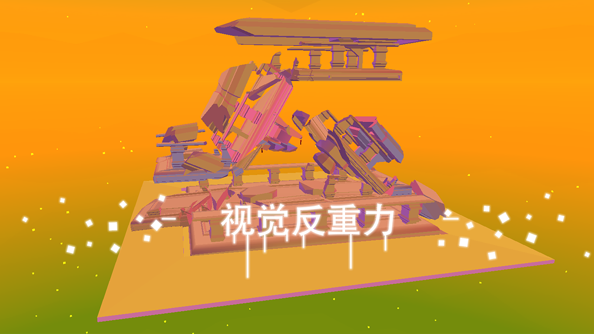

# 玩法

游戏的内核玩法是：

> 从一堆悬线中分辨出最需要的若干根，用最少的线实现平衡，达到**视觉反重力**的效果。

开发者也手绘了示意图：

上图肯定是不能平衡的，然后，在一根<u>悬吊线</u>的基础上再增加两根<u>平衡线</u>就能保持稳定了：

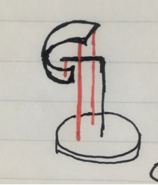

看懂这个示意图就够了，因为整个游戏都没有脱离这个框架。

# 关卡

游戏包括 12 道关卡，每个关卡是一个场景：

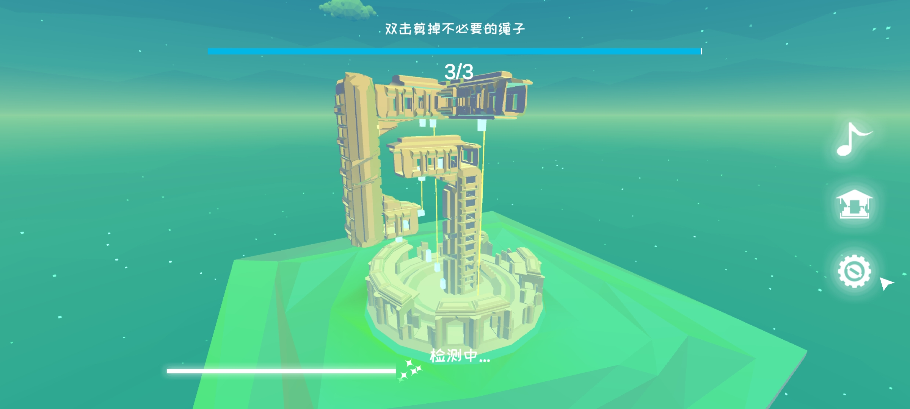

天文台

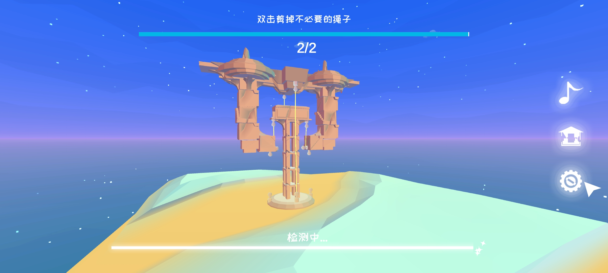

审判厅

智慧神庙

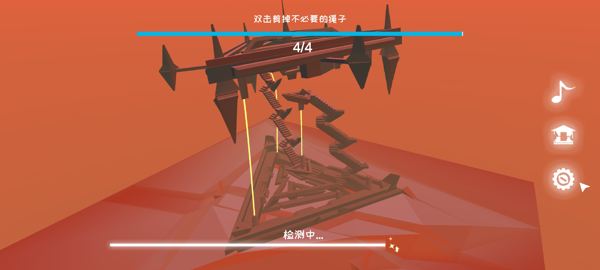

祭坛

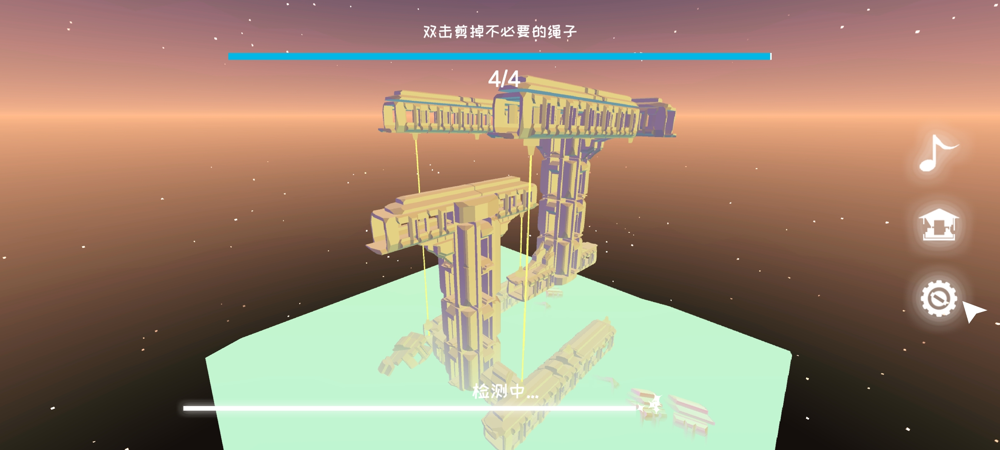

望塔

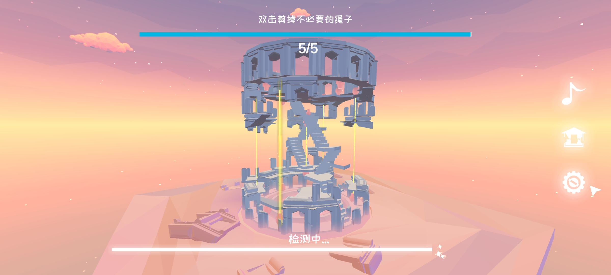

空中斗兽场

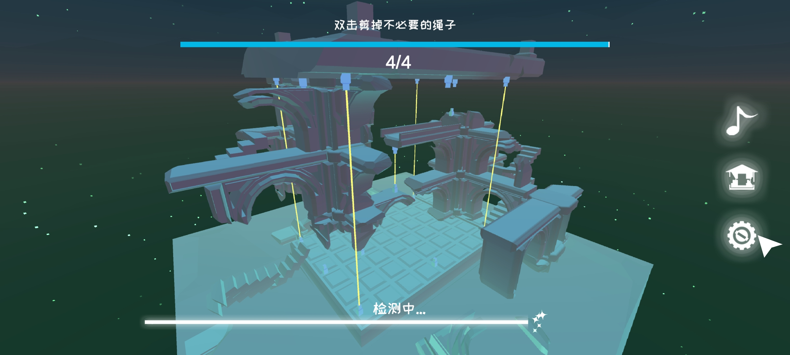

皇家宫殿

星宫

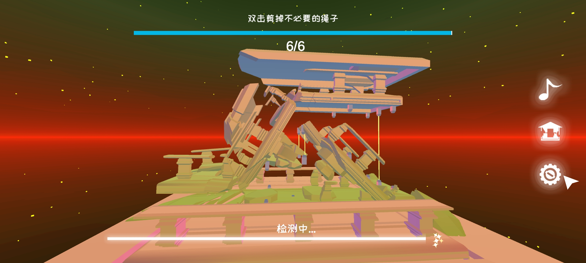

斜坡广场

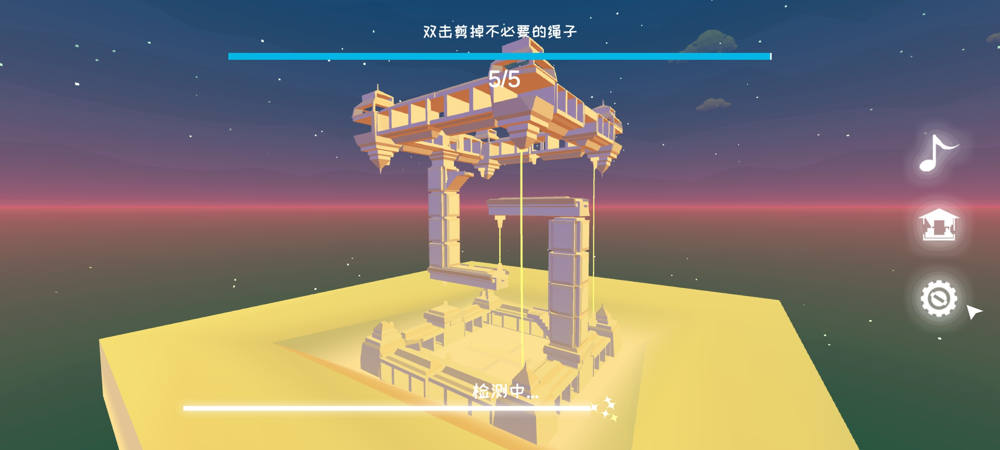

救赎监狱

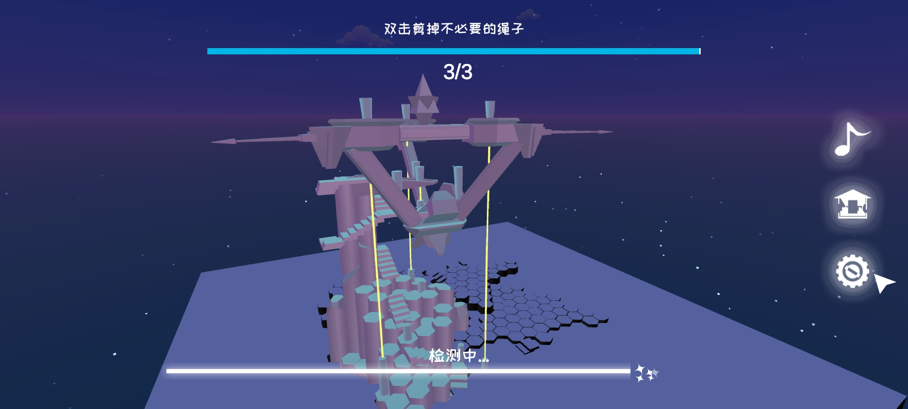

哨塔

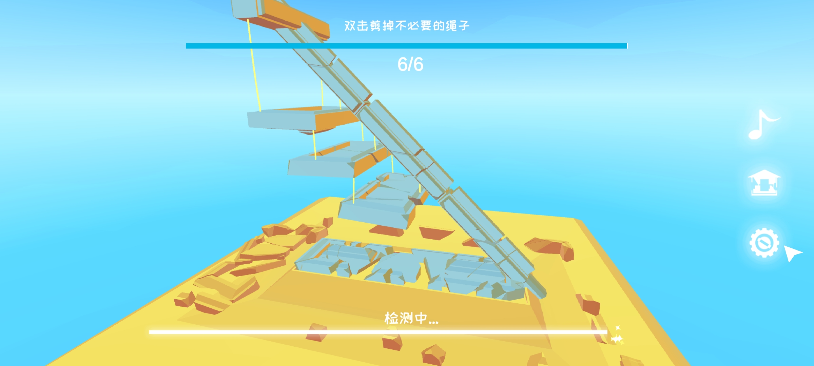

阶梯广场

# 不足

这个游戏 3D 做得不好，操作性也不友好，放大的时候常常对不准焦。
