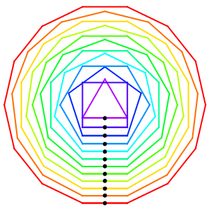

- **Mathematica 数学动图欣赏**是一个不定时更新的系列，这是第二期，也是最后一期
- Mathematica ~~天生会画图~~天生会画好看的图，不用来画图岂不很可惜，所以就诞生了这个系列
- 这个系列的动图并不是我原创的，都是**收集于网络**，然后我尝试**用 Mathematica 复现**出来
- 有些动图，原作者提供了参数，所以基本可以完全复现。对于不知道参数的动图，只能大概复现一下
- 本期提供了 5 类动图，创意来自 Motus-Art

# 动图 6

# 动图 7

# 动图 8

# 动图 9

# 动图 10

# 源代码

关注青崖同学公众号，想获取哪个动图的源代码，就回复 **gif+序号**，比如 **gif1** 代表动图 1。示例：

# 结尾

**Mathematica 数学动图欣赏**系列不会再更新了，当初做这个系列是因为 Motus-Art 的动图非常漂亮，然而他用的是 canvas，我那时根本没接触过 Javascript，就想用 Mathematica 复现，但是现在看来已经是没有必要了。做这个系列的另一个目的是想给公众号引流，我设置成关注公众号获取源代码，但是效果并不如预期。

如果想看更多有意思的动图，可以关注 [Motus-Art](https://github.com/owenmcateer/Motus-Art)。

