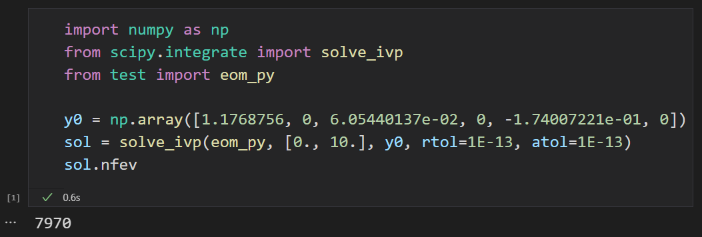
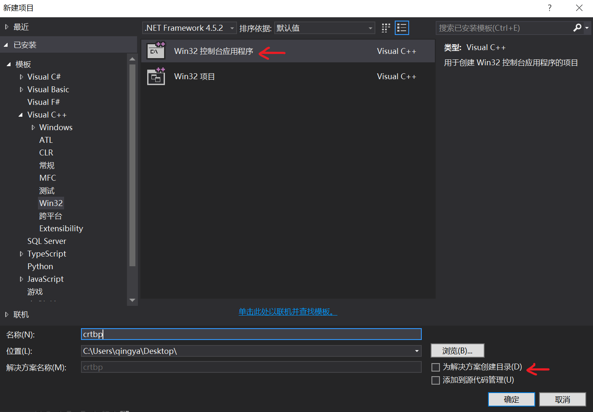
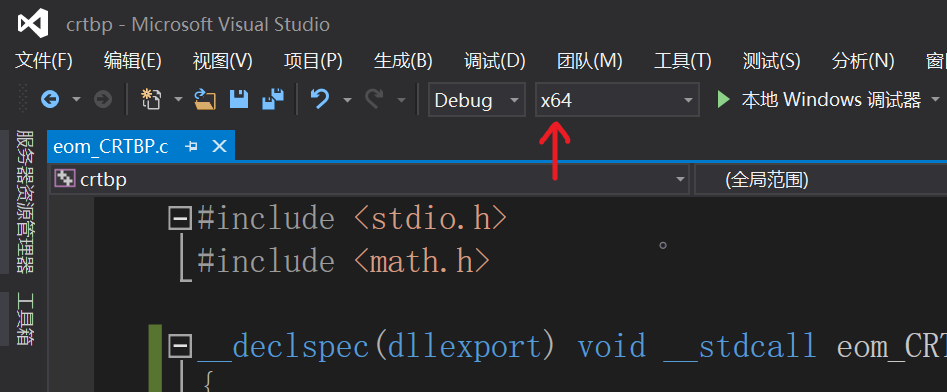
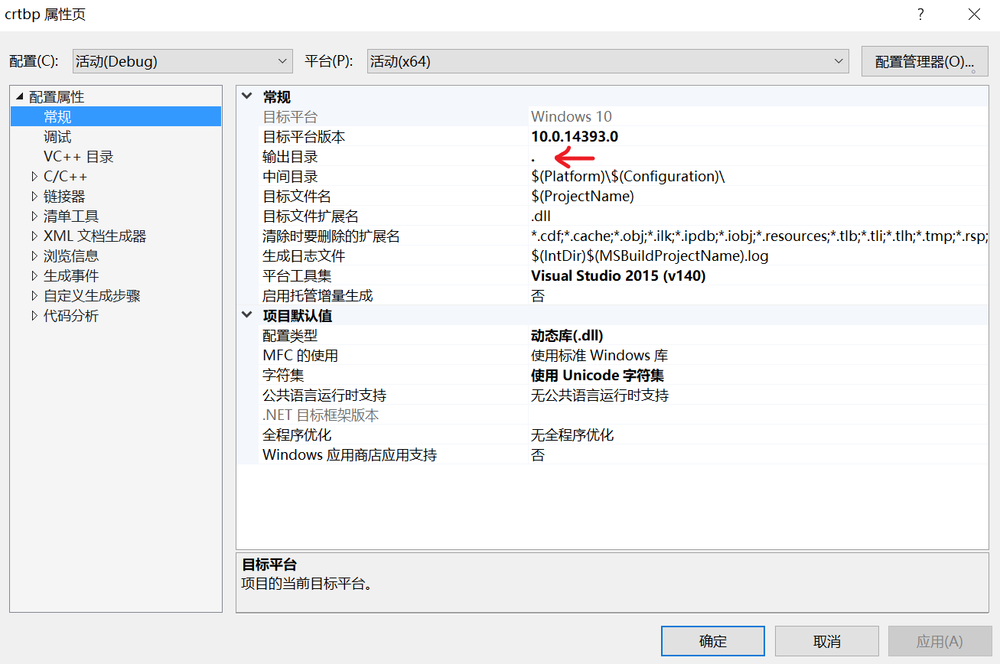
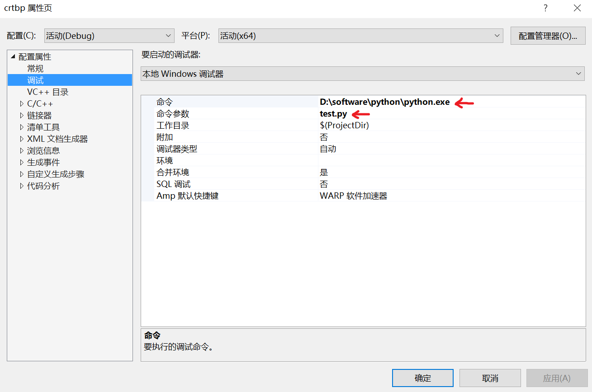
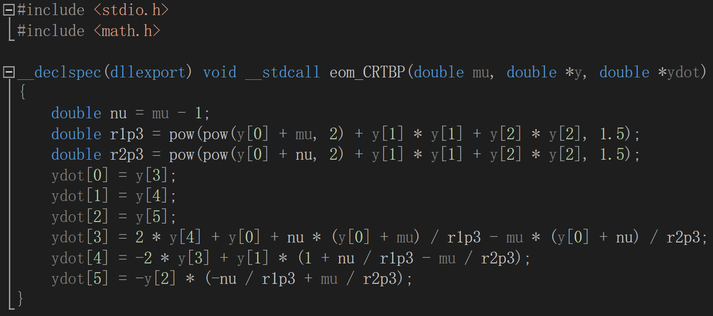
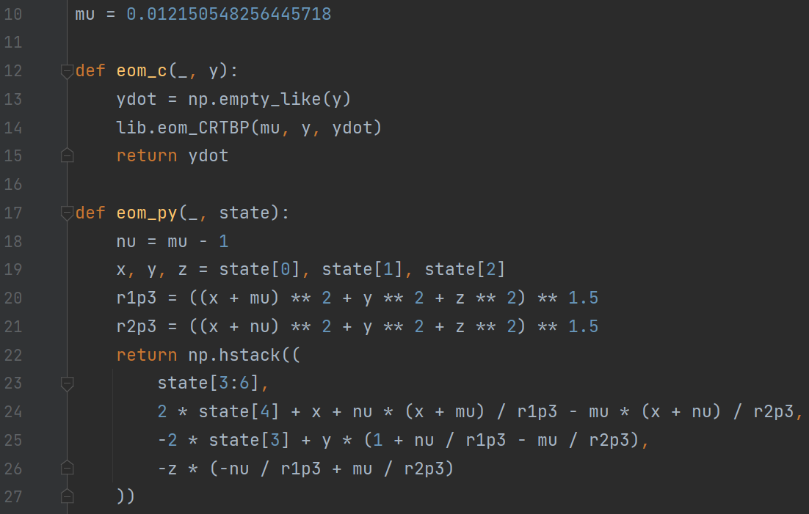
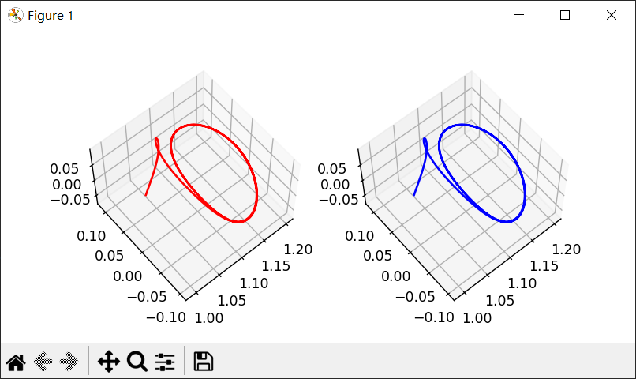
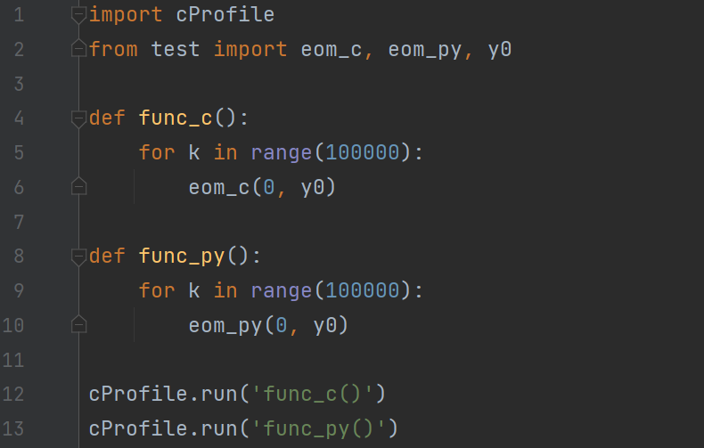
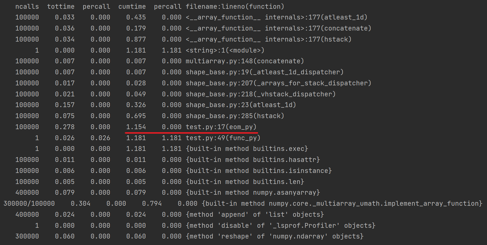

> 计算机科学课程（正确地）引导人们远离微观优化，转而寻求更理想的算法。计算成本一路走低，令压榨内存的必要性日益降低。旧日里，黑客们通过在陌生的硬件架构中跌跌撞撞学习——如今已不多见。然而（压榨内存）这项技术在关键时刻仍颇具价值，并且只要内存容量有限，价值就始终存在。
>
> Eric S. Raymond

简而言之：只要机器的性能有限，对机器的进一步压榨就该是我们开发者的使命。

对轨道力学来说，Equation of Motion，也就是中文语境下的动力学方程，是基础中的基础。对轨道力学的程序来说，动力学方程是被调用次数最多的函数之一。举个例子，下图的`eom_py()`函数是圆型限制性三体问题的动力学方程，具体实现细节暂时不用管，我们用 scipy 库提供的`solve_ivp()`函数求解常微分方程的初值问题。可以看到，求解过程中，`eom_py()`函数被调用了 7970 次。对于圆型限制性三体问题的一些算法，比如打靶法等，需要反复求解初值问题，所以动力学方程被调用的次数是值得引起注意的。

越基础的东西性能得到提升，对整个程序的影响越大。为此，我们尝试用 C 语言编写动态链接库，然后由 Python 调用，期望能提高程序的效率。

# C 语言部分

我们用 Visual Studio 2015 来开发动态链接库。新建项目，选择 Win32 控制台应用程序，项目名设为 crtbp，位置选择桌面，取消勾选为解决方案创建目录：

然后对项目进行一些配置，应用程序类型选择 DLL，附加选项选择空项目：

默认是生成 32 位应用程序，但是我的计算机安装的是 64 位 Python，二者必须保持统一才行，否则调用的时候会报错。所以要把 x86 改为 x64，如下图：

为了后续调试方便，我把`.dll`的输出路径设为项目根文件夹：

并且设置了调试命令，命令选择 Python 的安装路径，命令参数设为`test.py`，也就是后面我的 Python 脚本的文件名，工作目录为项目路径（因为我把`test.py`放到和 C 语言项目同一个路径）。这样当在 Visual Studio 里调试时，就会自动运行 Python 脚本。

配置好了之后，C 语言代码如下：

函数名为`eom_CRTBP()`，`__declspec(dllexport)`和`__stdcall`等关键字的作用是向外暴露该函数。其余部分就是正常 C 语言的写法，没啥好说的。

# Python 部分

先导入几个包，利用 Python 自带的 ctypes 模块来调用动态链接库，配置`lib.eom_CRTBP`的几个输入参数的类型，第一个参数为 double 类型的`mu`，那么就用`ctypes.c_double`，第二个和第三个参数都是数组名，本质是地址，而且这两个参数在 Python 中是 shape 为 (6,) 的 numpy.ndarray，我们利用 numpy 包提供的`ndpointer()`函数构造指针，代码如下：

然后编写两个动力学方程，`eom_c()`函数调用动态链接库，`eom_py()`则是按普通的 Python 语法来编写：

分别对这两个动力学方程积分，并画出对应的轨道，代码如下：

轨道如下：

可见，结果是一模一样的。

------

下面对比一下二者的性能，我们用 Python 自带的 cProfile 模块来做性能分析，`eom_c()`函数和`eom_py()`都调用 100000 次。代码如下：

`func_c()`的耗时情况如下：

`func_py()`的耗时情况如下：

`eom_c()`函数总耗时 0.889 秒，`eom_py()`函数总耗时 1.157 秒，性能提升了 23.3%，虽然效率提升的幅度比我预期的要低一些，但是还是较为可观的。可以预见，对于更复杂的动力学方程，以及轨道力学进阶必然会遇到的矩阵微分方程，性能提升会更明显。
