设想一下有一些单项式，应该按照什么准则对它们进行排序？这是一个很现实的问题，因为书写它们的时候总得有个先后次序吧。为了便于叙述，记单项式为 $\vec{x}^\vec{r} = x^{r_1}_{1} x^{r_2}_{2} \dots x^{r_n}_{n}$，其中 $\vec{x} = [x_1 \ \dots \ x_n]$ 为变量，$\vec{r} = [r_1 \ \dots \ r_n] \in \mathbb{N}^n$  为常量，不难发现 $\vec{x}^\vec{r}$ 的次数为 $k = |\vec{r}|$。

# 单项式的种类数

在探讨排序之前，有必要知道这种变量数为 $n$、次数为 $k$ 的单项式的种类数 $N(n,k)$ 是多少？

> 以 $n=3$，$k=3$ 为例，通过枚举可以写出：
> $$
> x^3_1 \quad x^2_1 x_2 \quad x_1 x^2_2 \quad x^3_2 \quad x^2_1 x_3 \quad x_1 x_2 x_3 \quad x^2_2 x_3 \quad x_1 x_3^2 \quad x_2 x^2_3 \quad x^3_3
> $$
> 共 10 种，所以 $N(3,3) = 10$。
>
> 注：虽然书写时省略了 0 次方，但这并不代表它们不存在。

分成以下三种情况讨论：

- Case 1: 当 $n=0$ 时，意味着不存在变量，这种情况无意义，即 $N(0,k) = 0$
- Case 2: 当 $k=0$ 时，意味着只有 $x^{0}_{1} x^{0}_{2} \dots x^{0}_{n}$ 一种情况，即 $N(n,0) = 1$
- Case 3: 当 $n\neq0$ 且 $k\neq0$ 时，把向量 $\vec{x}$ 的最后一个元素 $x_n$ 分离出来，得到新的向量 $\vec{\hat{x}} = [x_1 \ \dots \ x_{n-1}]$。用 $\vec{\hat{x}}$ 构造单项式，次数为 $k$ 的单项式通称为 $X_k$，则可把 $\vec{x}^\vec{r}$ 分为如下 $k+1$ 类：

$$
X_{k}x^0_n \quad X_{k-1}x^1_n \quad X_{k-2}x^2_n \quad \dots \quad X_{0}x^k_n
$$

那么 $N(n,k)$ 自然等于这 $k+1$ 类各自的种类数相加，即
$$
N(n,k) = N(n-1,k) + N(n-1,k-1) + N(n-1,k-2) + \dots + N(n-1,0)
$$
简单验证一下：

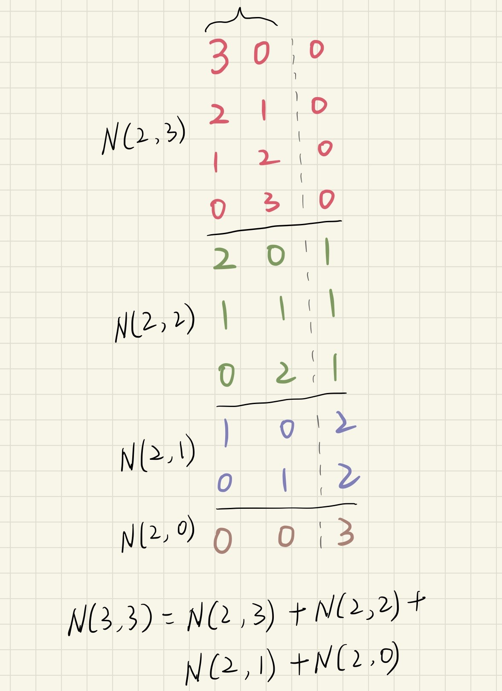

对上式作变量替换，用 $k-1$ 替换 $k$
$$
N(n,k-1) = N(n-1,k-1) + N(n-1,k-2) + \dots + N(n-1,0)
$$
惊喜地发现
$$
N(n,k) = N(n-1,k) + N(n,k-1)
$$
根据这个关系，可以构造一张表格。

------

先把 Case 1 和 Case 2 在表格上表示出来：

对于 Case 3 来说，$N(n-1,k)$ 在 $N(n,k)$ 的上侧，$N(n,k-1)$ 在 $N(n,k)$ 的左侧，示意图如下：

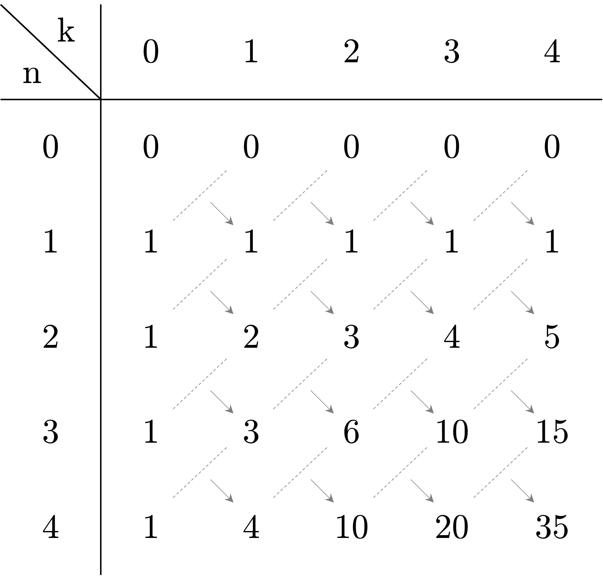

用 C++ 实现以上过程：

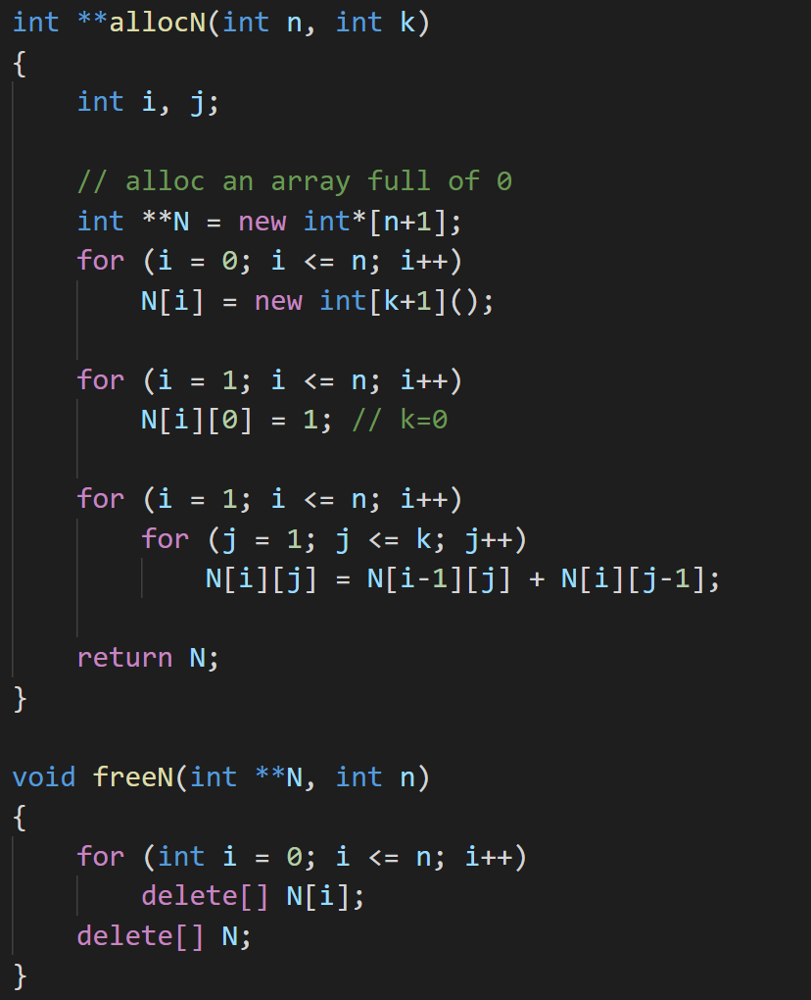

这个表格中蕴含着贾宪（杨辉）三角形：

如果想要计算任意位置的 $N(n,k)$，每次都需要列表很麻烦，那么 $N(n,k)$ 有没有通项公式呢？有的，我们直接给出结论：
$$
N(n+1,k) = {n+k \choose k}
$$
其中，组合数 ${n+k \choose k}$ 还有另外一种写法 $C_{n+k}^k$。

可以用数学归纳法进行证明：

> - 当 $k=0$ 时，对任意的 $n \geq 0$，都有 $N(n+1,0) = {n \choose 0} = 1$ 成立。
> - 当 $k = \hat{k}$ 时，假设对任意的 $n \geq 0$，都有 $N(n+1,\hat{k}) = {n+\hat{k} \choose \hat{k}}$ 成立。
> - 证明当 $k = \hat{k}+1$ 时，对任意的 $n \geq 0$，都有 $N(n+1,\hat{k}+1) = {n+\hat{k}+1 \choose \hat{k}+1}$ 成立，即可
>
> $$
> \begin{aligned}
> N(n+1,\hat{k}+1)
> &= N(n+1,\hat{k}) + N(n,\hat{k}+1)\\
> &= {n+\hat{k} \choose \hat{k}} + N(n,\hat{k}) + N(n-1,\hat{k}+1)\\
> &= {n+\hat{k} \choose \hat{k}} + {n+\hat{k}-1 \choose \hat{k}} + N(n-1,\hat{k}) + N(n-1,\hat{k}-1)\\
> &= {n+\hat{k} \choose \hat{k}} + {n+\hat{k}-1 \choose \hat{k}} + {n+\hat{k}-2 \choose \hat{k}} + \dots\\
> &= {n+\hat{k} \choose \hat{k}} + {n+\hat{k}-1 \choose \hat{k}} + \dots + {\hat{k} \choose \hat{k}}\\
> &= {n+\hat{k}+1 \choose \hat{k}+1}
> \end{aligned}
> $$
>
> 得证。
>
> 备注：上式最后一个等号利用了**朱世杰恒等式**：
> $$
> {p \choose p} + {p+1 \choose p} + \dots + {m \choose p} = \sum_{i=p}^{m}{i \choose p} = {m+1 \choose p+1}
> $$

我们探讨了单项式的种类数问题，直接给出了通项公式，并用数学归纳法进行了证明。但是数学归纳法只能证明，却不能告诉来历。既然通项是组合数的形式，那么 $N(n+1,k)$ 很可能具有组合意义，我们尝试从组合数学的角度理解一下。$N(n+1,k)$ 代表着方程 $|\vec{r}| = r_1 + \dots + r_{n+1} = k$ 的自然数解的个数（因为 $k$ 是单项式的次数），用组合数学里经典的**隔板法**就可以直接给出结果了。

> - 先考虑 $|\vec{r}| = r_1 + \dots + r_{n+1} = k$ 的正整数解的个数。这一问题等价于 $k$ 个小球用 $n$ 个隔板隔开，每个区域至少一个小球。比如：
>
> $$
> \begin{array}{c}
> \circ \mid \circ \mid \circ \circ \\
> \circ \mid \circ \circ \mid \circ \\
> \circ \circ \mid \circ \mid \circ \\
> \dots
> \end{array}
> $$
>
> 问题又等价于从 $k-1$ 个小球间隔中选 $n$ 个放隔板，答案一目了然，为 $k-1 \choose n$。
>
> - 再考虑自然数解的情况。$r_1 + \dots + r_{n+1} = k$ 等价于 $(r_1 + 1) + \dots + (r_{n+1} + 1) = k + n + 1$，那么 $r_1 + \dots + r_{n+1} = k$ 的自然数解个数等价于 $a_1 + \dots + a_{n+1} = k + n + 1$ 的正整数解个数，为 ${k+n \choose n} = {k+n \choose k}$，得证。

# 朱世杰恒等式

结合表格，当 $n=2$ 时，有
$$
\begin{aligned}
N(2,k)
&= 1 + 2 + 3 + \dots + k\\
&= \frac{k(k+1)}{2} = {k+1 \choose 2}
\end{aligned}
$$
当 $n=3$ 时，有
$$
\begin{aligned}
N(3,k) &= 1 + 3 + 6 + \dots + \frac{k(k+1)}{2}\\
&= \frac{k(k+1)(k+2)}{6} = {k+2 \choose 3}
\end{aligned}
$$
当 $n=4$ 时，有
$$
\begin{aligned}
N(4,k) &= 1 + 4 + 10 + \dots + \frac{k(k+1)(k+2)}{6}\\
&= \frac{k(k+1)(k+2)(k+3)}{24} = {k+3 \choose 4}
\end{aligned}
$$
上一行的前 $k$ 项和是下一行的通项。以上过程实际上就是朱世杰（1249 年－1314 年）的**垛积法**的核心思想。垛积法出自朱世杰的著作《四元玉鉴》（1303年）。所谓垛积，即堆垛求积，研究某种物品按一定规律堆积起来求其总数问题。

- $n=2$ 对应**茭草垛**，即把茭草捆扎成束，进行堆垛，每层比下层少一束，求总和。

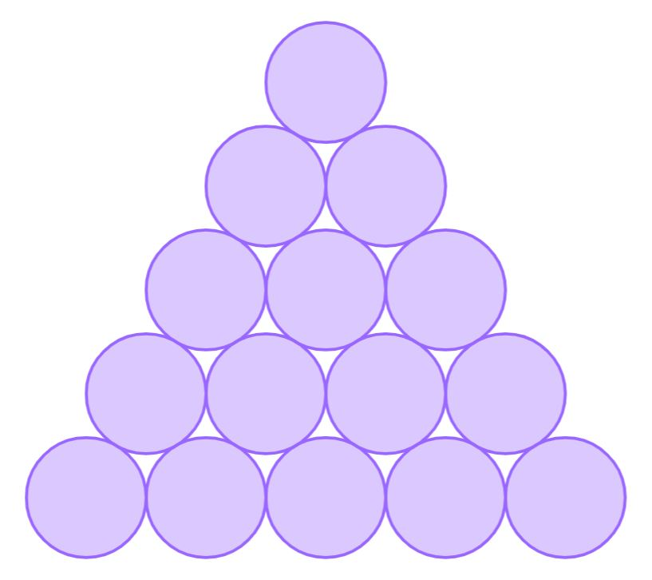

- $n=3$ 对应**三角垛**，可以用果子举例，每一层的果子按照茭草垛来排列，从最上层开始每层果子数为 $1, 3, 6, 10, \dots$

有实物演示如下：

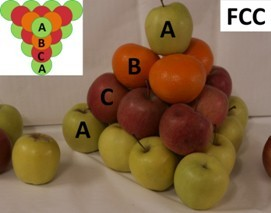

这种堆积形式还叫作**面心立方最密堆积**，空间利用率为 $\frac{\pi}{3\sqrt{2}} \approx 74\%$，是空间最密的堆积方式之一。金、银、铜等金属的晶胞是这种结构，在高中化学《物质的结构与性质》中曾介绍过（当年对这些信手拈开）。至于为何是空间最密的堆积方式“之一”，因为还有一种**六方最密堆积**和它的空间利用率相同：

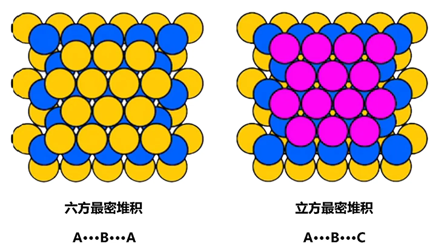

- $n=4$ 对应**撒星形垛**，还用果子举例，从最上层开始每层果子数应为 $1, 4, 10, 20, \dots$但是，撒星形到底是什么形状，我没有找到任何有关的描述，它还有一个名字叫做『三角更落一垛』。有一种较为合理的可能，它对应四维空间的堆积问题（而且有可能是四维空间的最密堆积）。不妨类比一下，所谓茭草垛其实对应着『平面圆形最密堆积』，三角垛对应着『立体球体最密堆积』，那么撒星形垛是否对应着『四维超球最密堆积』？

对于平面最密堆积到立体最密堆积升维的过程，平面之外的那个维度上的层与层，投影回平面后，有一种关系，即下层的空隙可以容纳缩小版的上层，用图形表述如下：

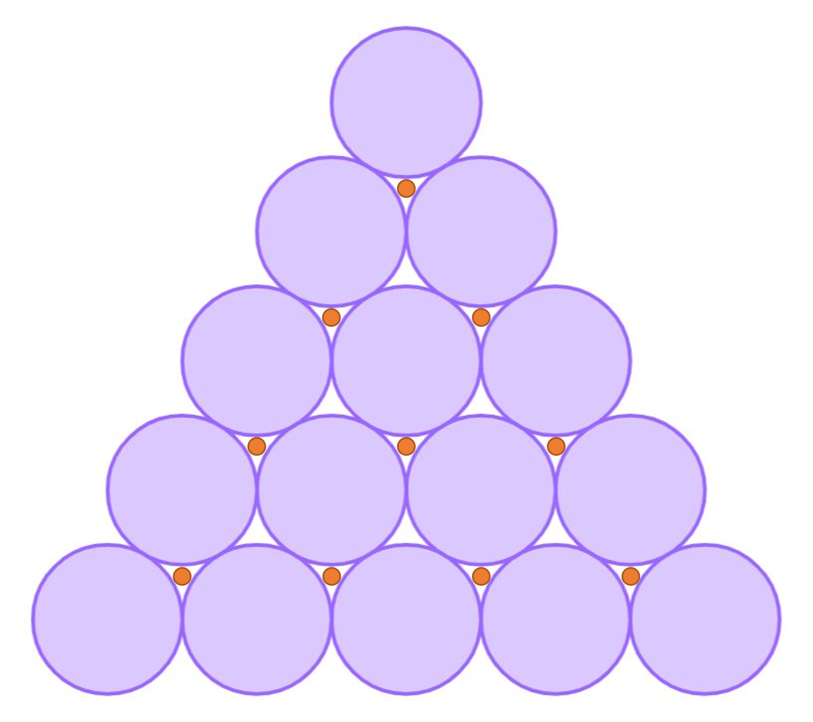

而且，对于立体最密堆积到四维空间堆积升维的过程，立体之外的那个维度上的层与层，投影回三维后，也有一种关系，即下层的空隙可以容纳缩小版的上层：

这似乎进一步印证了我们的猜想。

- 当 $n$ 更大的时候还有**三角撒星形垛**，**三角撒星更落一垛**等等。

> 我们再介绍一种方垛，从最上层开始每层果子数为 $1, 4, 9, 16, \dots$
>
> 
>
> 有实物演示如下：
>
> 
>
> 它对应的求和公式为：
> $$
> 1^2 + 2^2 + \dots + k^2 = \frac{k(k+1)(2k+1)}{6}
> $$
> 朱世杰的著作中也有这一公式，此外，他还研究了更高次方的求和问题，可见他对垛积问题的研究是成体系的。可以用朱世杰恒等式对上式进行证明：
> $$
> \begin{aligned}
> \sum_{i=1}^{k}i^2
> &= \sum_{i=1}^{k}\left[i(i+1)-i\right]\\
> &= 2\sum_{i=1}^{k}{i+1 \choose 2} - \sum_{i=1}^{k}{i \choose 1}\\
> &= 2{k+2 \choose 3} - {k+1 \choose 2}\\
> &= \frac{k(k+1)(2k+1)}{6}
> \end{aligned}
> $$
> 这种堆积形式还叫作**体心立方密堆积**，空间利用率为 $\frac{\sqrt{3}\pi}{8} \approx 68\%$，铁、钠、钾等金属的晶胞是这种结构，在高中化学《物质的结构与性质》中曾介绍过。

从以上介绍可见，朱世杰是从农业生产生活中提炼出了堆垛求积这一数学问题，并给出了一个恒等式。这一问题对应着现代数学的高阶等差数列求和，又对应着组合数学的一些概念。我们不知道朱世杰当时是如何计算出的，但是我们可以用现代数学的方式给出证明：

根据最原始的公式
$$
N(n+1,k) = N(n,k) + N(n,k-1) + \dots + N(n,0)
$$
回归到单项式概念下，$N(n,k)$ 代表着方程 $|\vec{r}| = r_1 + \dots + r_n = k$ 的自然数解的个数，$N(n,k-1)$ 代表着方程 $|\vec{r}| = r_1 + \dots + r_n = k-1$ 的自然数解的个数，以此类推。根据上文的结论可以写出：
$$
{n+k \choose n} = {n-1+k \choose n-1} + {n-1+k-1 \choose n-1} + \dots + {n-1 \choose n-1}
$$
经过变量替换，得到：
$$
\sum_{i=p}^{m}{i \choose p} = {m+1 \choose p+1}
$$
得证。除此之外，朱世杰恒等式[还有很多种证法](https://www.zzpxx.com/article/7008)，可以直接从其组合意义出发证明，也可以利用恒等式 ${m+1 \choose n+1} = {m \choose n} + {m+1 \choose n}$ 证明，还可以用等比数列求和结合二项式定理证明。

稍微插入几句题外话，还可以发现 $N(n,k) + \dots + N(n,0)$ 代表着 $|\vec{r}| = r_1 + \dots + r_n \leq k$ 的自然数解的个数，意味着：

> $r_1 + \dots + r_n \leq k$ 的自然数解的个数等于 $r_1 + \dots + r_{n+1} = k$ 的自然数解的个数。

# 单项式排序

通过以上讨论，我们知道了 $N(n,k)$ 的计算方法，那么我们用何种次序来书写这 $N$ 个单项式呢？或者说 $x^3_1$ 和 $x^2_1 x_2$ 谁在前？

对 $N$ 个单项式，我们有 $N!$ 种排序方式，其中有的排序是有规律可寻的，有的是毫无章法的，我们总不能每次都随心所欲地书写吧，有没有一种排序的准则呢？

有一种准则叫做 Graded Reverse Lexicographical Monomial Order，简称 GRevLex，翻译过来大概是『分级逆词序单项式排序』。规则如下：对于两个单项式 $\vec{x}^{\vec{r}_1}$ 和 $\vec{x}^{\vec{r}_2}$，若 $|\vec{r}_1| > |\vec{r}_2|$，则前者的次序大（次序大意为排得靠前）。若 $|\vec{r}_1| = |\vec{r}_2|$，当向量 $\vec{r}_1 - \vec{r}_2$ 的最后一个非零元素为负，则前者的次序大。

> 举个例子，对于 $x^3_1$ 和 $x^2_1 x_2$，或者叫做 $x^3_1 x^0_2 x^0_3$ 和 $x^2_1 x^1_2 x^0_3$，因为二者次数相等，所以比较向量 $[3,0,0] - [2,1,0] = [1,-1,0]$ 的最后一个非零元素 $-1$，由于 $-1 < 0$，因此 $x^3_1$ 的次序靠前。

直接通过 C++ 代码展示如何用 GRevLex 对这 $N$ 个单项式进行排序：

`nextOrder()`函数输入一个 order，内部进行一些处理，把 order 变为下一个 order

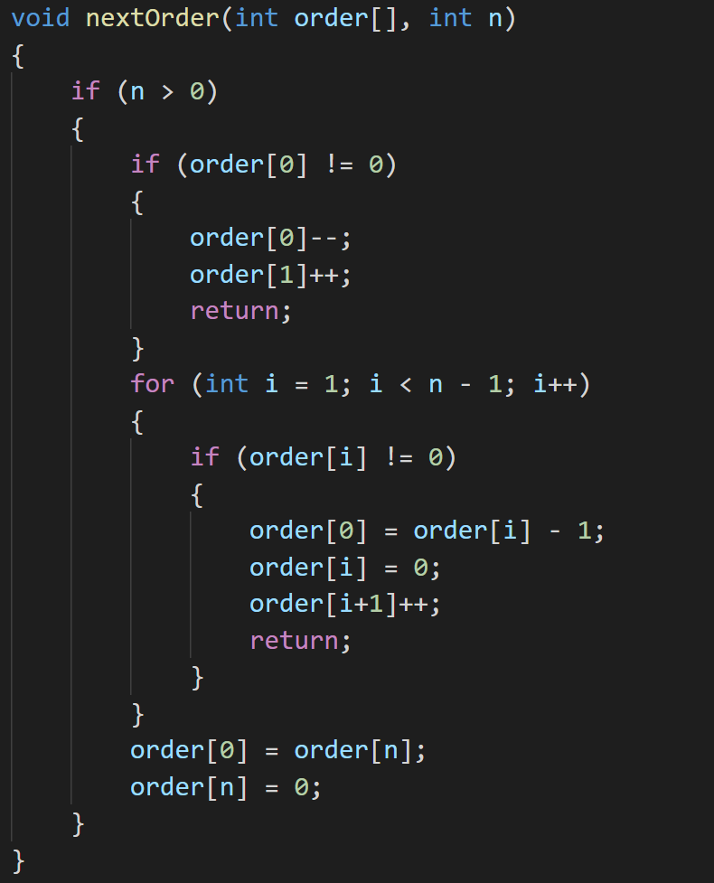

`main()`函数里，起始的 order 设为`k 0 0 ...`，然后对`nextOrder()`循环 $N(n,k)$ 次，并打印：

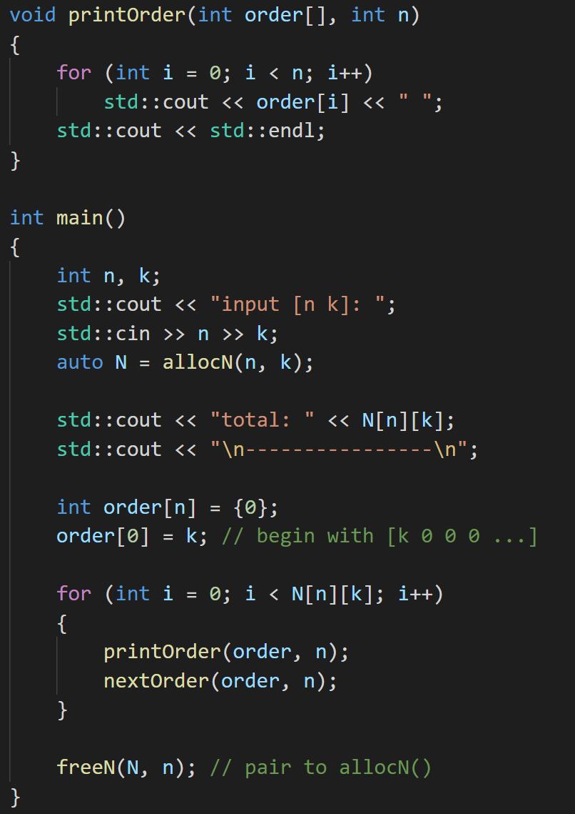

输入 $n=3$，$k=3$，结果为：

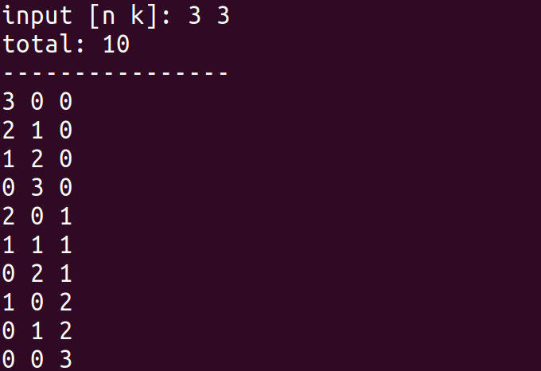

与之相应的排序为：
$$
x^3_1 \quad x^2_1 x_2 \quad x_1 x^2_2 \quad x^3_2 \quad x^2_1 x_3 \quad x_1 x_2 x_3 \quad x^2_2 x_3 \quad x_1 x_3^2 \quad x_2 x^2_3 \quad x^3_3
$$
再比如 $n=3$，$k=4$，结果为：

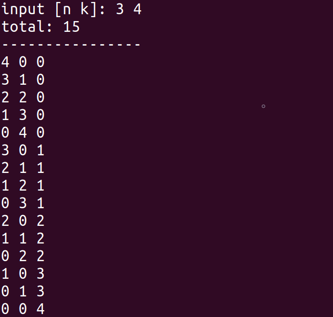

