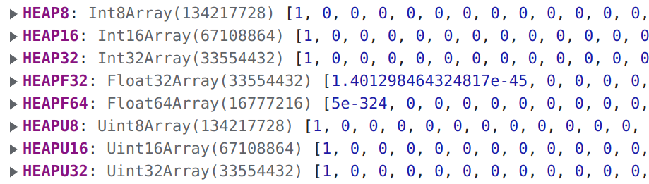

两年前我刚刚接触 Web 前端技术的时候，就时常思考如何实现在浏览器上执行 C 程序，这件事有两重意义：

- 一方面，是因为 JavaScript 是解释型语言，性能有限，对于逻辑复杂、计算密集型的算法，还是适合用 C 来实现。比如 [Runge-Kutta-Fehlberg](https://en.wikipedia.org/wiki/Runge%E2%80%93Kutta%E2%80%93Fehlberg_method) 算法；
- 另一方面，现代 V8 引擎对 JavaScript 的优化其实还是很可观的，借助 C 来提高性能有时候并非不可或缺，但是如果手里已经有了成熟的 C 语言代码，先不说用 JavaScript 重写一遍的庞大迁移成本，有些功能在语言层面上也根本无法实现，比如直接操作内存。以 [cspice](https://naif.jpl.nasa.gov/naif/toolkit.html) 工具箱为例，共有 2000 多个源文件，其中不少源文件还是用 f2c 从 fortran 代码翻译过来的，能够使用已经需要较高的知识储备了，把它重写一遍简直是无稽之谈。

由于当时眼界有限，我并不知道有什么实现方案，能想到的就是退而求其次：前后端结合，让 C 程序运行在后端服务器上，但是前后端的通信延迟和通信数据量都是问题。**有没有一种让 C 程序以原生（近原生）性能运行在浏览器端的方案呢**？

# WebAssembly 技术

以前对 WebAssembly 技术略有耳闻，最近抽时间简单的入门了一下，确实可以完美地解决上述需求。


WebAssembly（缩写为 WASM）是一种使用非 JavaScript 代码，并使其在浏览器中以接近原生的速度运行的技术。WASM 并不是一门新的编程语言，而是被设计为 C/C++/Rust/Go 等语言的编译目标，本质是二进制文件，可以直接在 JavaScript 中将其当作模块来用，通常借助 [Emscripten](http://kripken.github.io/emscripten-site/index.html) 来编译（见下图）。它的优点在于，它是一个编译后的二进制格式，容易翻译到原生代码，本地解码速度也比 JS 解析快得多。


一个商业案例是 [Bilibili 的稿件前端处理技术](https://www.w3.org/2020/08/wasm-media.pdf)。以往，一个 UP 主投稿，需要把稿件完整上传到 Bilibili 后端服务器，再由后端进行检测、转码等操作。缺点在于，如果该稿件有编码格式等方面的问题，此时已经造成了云端资源的⽩⽩浪费。即使稿件没有任何问题，云端服务器也支付了一定的算力成本。如果视频检测、转码等能够在客户端（网页端）进行，充分利用客户端的算力，对 Bilibili 这样的网站确实能够大幅减少算力支出。如今，打开 [Bilibili 创作中心](https://member.bilibili.com/platform/upload/video/frame)的网页，进入 DevTools（见下图），你会发现两个略有违和感的名字：[FFmpeg](https://ffmpeg.org/) 和 [tensorflow](https://www.tensorflow.org/)，二者分别处在当今多媒体处理和机器学习工具链最顶级的位置，违和的地方在于，这两个工具分别是用 C/C++ 和 Python 实现的，为何会出现在 JavaScaipt 的环境下？因为这两个工具被编译成了 WASM，如此便可实现在前端通过 FFmpeg 处理多媒体文件，并对本地视频进行截图进而通过 tensorflow AI 模型进⾏封⾯推荐。


除此之外，还有一些商业上的成功应用：

- 高性能在线复杂数据可视化，比如 [perspective](https://github.com/finos/perspective)
- 在线计算机辅助设计，比如 [AutoCAD Web App](https://web.autocad.com/)
- 在线音视频处理，比如[实时图像分割](https://www.agora.io/cn/community/blog-121-category-21976)
- 在线大型游戏

目前，一些流行的 C/C++库，比如， [SDL](https://en.wikipedia.org/wiki/Simple_DirectMedia_Layer)、 [OpenGL](https://en.wikipedia.org/wiki/OpenGL)、[FFmpeg](https://ffmpeg.org/) 等都有对应的 WASM 实现。三大浏览器也早在几年前就已经全面支持了 WASM。


简单总结，我认为 WebAssembly 技术的一部分意义在于：充分发挥客户端的计算能力，以近乎零成本复用其他编程语言技术栈。

我是跟着[一个很好的入门教程](https://marcoselvatici.github.io/WASM_tutorial/)入门的。学习它的最重要的目的就是在我的领域（轨道力学）应用它。那么本文就以 cspice 为例，介绍如何在 Linux 下从头构建并使用 WebAssembly。

# 安装 emsdk

首先搭建 Emscripten 的环境，需要安装 emsdk，可以直接从 emsdk 的官方仓库下载：

```bash
git clone https://github.com/emscripten-core/emsdk.git
cd emsdk
git pull
```

然后安装 SDK：

```bash
# Download and install the latest SDK tools.
./emsdk install latest

# Make the "latest" SDK "active" for the current user. (writes .emscripten file)
./emsdk activate latest
```

------

Arch Linux 可以通过`yay`下载：

```bash
yay -S emsdk
```

但是安装 SDK 的时候需要给管理员权限：

```bash
sudo emsdk install latest
sudo emsdk activate latest
```

此时，`emcc`编译器便已经安装了，不过**每次使用之前需要配置**必要的环境变量：

```bash
source "/usr/lib/emsdk/emsdk_env.sh"
```

上面这种方法只能暂时性地在当前进程中添加环境，如果想要持久地添加环境，可以执行：

```bash
echo 'source "/usr/lib/emsdk/emsdk_env.sh"' >> ~/.bashrc
source ~/.bashrc
```

# 下载 cspice

```bash
mkdir use-cspice
cd use-cspice
wget https://naif.jpl.nasa.gov/pub/naif/toolkit/C/PC_Linux_GCC_64bit/packages/cspice.tar.Z
gzip -d cspice.tar.Z
tar xf cspice.tar
```

由于后面要对源码作简单修改，最好借助 git 作版本控制，既方便比较前后修改，又方便出问题后回退。把原始的代码进行 commit：

``` bash
cd cspice
git init
git add .
git commit -m "origin"
```

# 对 cspice 源码作简单修改

## 修改`s_copy()`函数

打开`cspice/src/cspice/s_copy.c`，可以看到函数`s_copy()`的返回值是`void`类型：


但是，打开`cspice/src/cspice/putlms.c`，可以看到函数`s_copy()`被声明为返回值是`int`类型：


而且有非常多的函数作了这样的声明，全局搜索一下，共有 542 处：


如果采用`gcc`编译器，在链接阶段不会报错。但是`emcc`会报错，警告函数签名不一致：


有两种解决方案：

- 可以把`cspice/src/cspice/s_copy.c`的函数`s_copy()`的返回类型改为`int`，并在该函数最后`return 0`
- 也可以把这 542 处声明的返回类型改为`void`

提示：如果采用第一种方案，还要把`cspice/src/cspice/ef1asc_.c`的`s_copy()`的返回类型改为`int`。

## 修改`s_cat()`函数

位于文件`cspice/src/cspice/s_cat.c`，与函数`s_copy()`的问题类似，类比其进行修改即可。

## 修改`zzsetnnread_()`函数

还是函数实现和函数声明不一致的问题。函数实现在文件`cspice/src/cspice/rsfe.c`，返回值为`void`类型。文件`cspice/src/cspice/rdker.c`将其声明为返回`int`类型，全局只发现这一处声明有误，所以把这里改为返回`void`类型即可。

# 编译 JavaScript 和 WASM

先把 cspice 两千多个源文件编译成静态库：

```bash
cd use-cspice
mkdir -p build
cd build
emcc -c -O2 -I../cspice/include\
    -Wno-parentheses\
    -Wno-shift-op-parentheses\
    -Wno-logical-op-parentheses\
    -Wno-bitwise-op-parentheses\
    -Wno-dangling-else\
    -Wno-format\
    -Wno-implicit-int\
    -Wno-deprecated-non-prototype\
    ../cspice/src/cspice/*.c
emar rcsv ../libcspice_wasm.a *.o
cd ..
```

如此便得到了静态库 `libcspice_wasm.a`，然后进行链接：

```bash
emcc -O2 libcspice_wasm.a -o cspice.js \
    -s MODULARIZE=1 \
    -s EXPORT_ES6=1 \
    -s USE_ES6_IMPORT_META=1 \
    -s WASM=1 \
    -s ENVIRONMENT="web" \
    -s TOTAL_MEMORY=134217728 \
    -s EXPORT_NAME=cspice \
    -s EXPORTED_RUNTIME_METHODS="['FS','ccall','cwrap','getValue','setValue','UTF8ToString']" \
    -s EXPORTED_FUNCTIONS="['_furnsh_c','_spkpos_c','_utc2et_c','_malloc','_free']"
```

这一步骤会生成`cspice.js`和`cspice.wasm`两个文件。我们向外暴露了`furnsh_c()`、`spkpos_c()`和`utc2et_c()`三个函数，它们位于`libcspice_wasm.a`之中。还暴露了`malloc()`和`free()`两个函数

# 使用 WASM

我们先从 [NAIF](https://naif.jpl.nasa.gov/pub/naif/) 官网下载几个 kernel 文件：

``` bash
url='https://naif.jpl.nasa.gov/pub/naif/generic_kernels/'
for kernel in 'lsk/latest_leapseconds.tls' 'spk/planets/de432s.bsp' 'pck/gm_de440.tpc' 'pck/pck00011.tpc'
do
  wget $url$kernel
done
```

然后把如下代码保存为`index.html`，并且执行`python -m http.server`构造 localhost，然后在浏览器打开 http://0.0.0.0:8000/

```html
<!DOCTYPE html>
<html lang="en">
<head>
    <meta charset="UTF-8">
    <title>Test</title>
</head>
<body>
	<div id="sun"></div>
    <script type="module">
        import cspice from './cspice.js';
		const Module = await cspice();
        
        const DOUBLE_SIZE = 8;
		const DOUBLE_TYPE = 'double';
        
        function furnsh(file) {
            Module.ccall(
                'furnsh_c',
                null,
                ['string'],
                [file],
            );
        }
        
        function spkpos(targ, et, ref, abcorr, obs) {
            // create output pointers
            const ptarg_ptr = Module._malloc(DOUBLE_SIZE * 3);
            const lt_ptr = Module._malloc(DOUBLE_SIZE);

            Module.ccall(
                'spkpos_c',
                null,
                ['string', 'number', 'string', 'string', 'string', 'number', 'number'],
                [targ, et, ref, abcorr, obs, ptarg_ptr, lt_ptr],
            );

            // read and free output pointers
            const ptarg = [
                Module.getValue(ptarg_ptr + DOUBLE_SIZE * 0, 'double'),
                Module.getValue(ptarg_ptr + DOUBLE_SIZE * 1, 'double'),
                Module.getValue(ptarg_ptr + DOUBLE_SIZE * 2, 'double'),
            ];
            Module._free(ptarg_ptr);

            const lt = Module.getValue(lt_ptr, 'double');
            Module._free(lt_ptr);

            return [ ptarg, lt ];
        }
        
        function utc2et(utcstr) {
            const et_ptr = Module._malloc(DOUBLE_SIZE);
            Module.ccall(
                'utc2et_c',
                null,
                ['string', 'number'],
                [utcstr, et_ptr],
            );
            const et = Module.getValue(et_ptr, DOUBLE_TYPE);
            Module._free(et_ptr);
            return et;
        }

        // Load the kernels to virtual FS
        const kernelBuffers = await Promise.all([
            './latest_leapseconds.tls',
            './de432s.bsp',
            './gm_de440.tpc',
            './pck00011.tpc'
        ].map(kernel => fetch(kernel).then(res => res.arrayBuffer())));
        kernelBuffers.forEach((buffer, idx) => {
            let kernel = `${idx}.ker`;
            Module.FS.writeFile(kernel, new Uint8Array(buffer), { encoding: 'binary' });
            furnsh(kernel);
        });

        setInterval(() => {
            const utc = new Date().toISOString().slice(0, -1);
            const et = utc2et(utc);
            const [sun,] = spkpos('SUN', et, 'J2000', 'LT+S', 'EARTH');
            console.log(sun);
            document.getElementById('sun').innerHTML = `utc: ${utc}</br>sun: ${sun.toString()}`;
        }, 10);
    </script>
</body>
</html>
```

以上代码中，先从`cspice.js`导入`cspice()`函数，这是一个异步函数，所以需要用`await`等待其返回结果。用`Module`接收返回结果，它是一个对象，包含了所有必要的成员变量与成员方法。为了更好地使用`Module`，我们制作了一些 warpper 函数，也就是`furnsh()`、`spkpos()`和`utc2et()`，在这些函数内部实现了内存的分配与释放、对 C 函数的调用等。然后我们 fetch 一些必要的 kernel 文件，并将其保存在虚拟文件系统中，然后用`furnsh()`读取 kernel 文件。最后我们设置周期为 10 ms 的定时器，打印当前时刻太阳的位置。

打开浏览器的 console，即可看到输出的太阳的位置，以 Google Chrome 为例：


大功告成！


而且感觉运行效率还算不错。更进一步的话，可以结合 WebGL 技术搭建太阳系场景，并用`cspice.wasm`实现数据驱动，以实现在浏览器上渲染出真实的太阳系场景。

# Magic Number 134217728

我们在链接的时候设定了一个选项`-s TOTAL_MEMORY=134217728`，指定总内存为 134217728，这其实是一个 magic number，它等于`1 << (7 + 10 + 10)`，即 2 的 27 次方，它的意义是 128 MB，是一块虚拟内存的大小。之所以说它是虚拟内存，因为 WASM 运行在一个受保护的环境中，本质是一个 Sandbox，不被允许接触外部的内存（如果能，将造成极大的安全隐患）。它本质上是一个超大的 js 数组，而且模拟的是堆内存，对内存的 malloc 和 free 等操作实际上是在操作这个数组里的数据。打开 Google Chrome 的 console，并打印`Module`，会看到几个 HEAP 开头的成员变量：


它们分别对应 C 语言的`int8_t`、`int16_t`、`int`、`float`、`double`、`u_int8_t`、`u_int16_t`、`unsigned int`。这里有一点值得谈谈：

------

细心的话，会发现这些数组每一个的大小都是 128 MB，这是否意味着总内存其实是 8 * 128 MB？答案是否定的，这几个数组实际上只是 view，是对一个真实占有着内存的数组的引用。这一点可以从源码得到证实：


我们尝试把`Module.HEAP8`的第一个元素改为 1（准确地说，是 0x01），再打印`Module`，会看到所有 HEAP 开头的成员变量都被改变了：



真实占有着内存的数组是`Moudle.asm.memory.buffer`，可以在内存检查器当中更直观地查看：


也可以打开 Google Chrome 的 Task Manager（Linux 是 Shift + Esc），当前 Tab 所占的内存约为 98 MB，说明我们并没有多个 128 MB 的虚拟内存：


