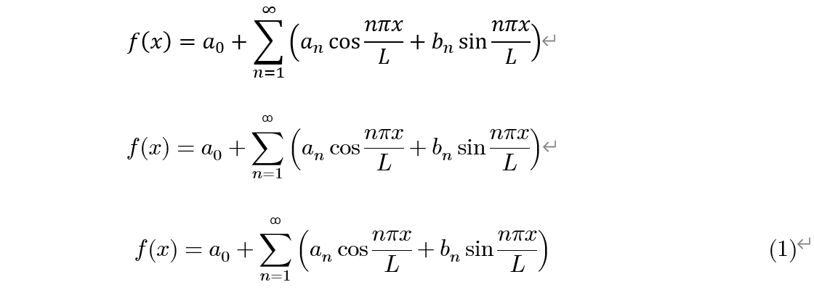
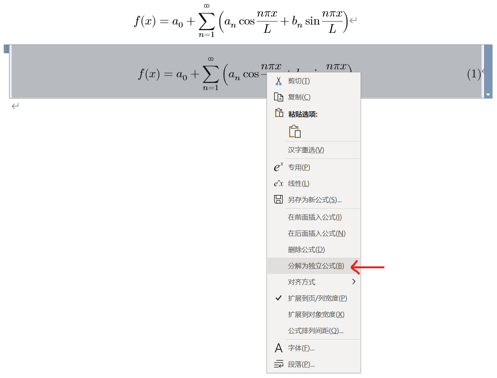

首先我们抛开这个问题是否含有自虐的成分，以及先不考虑是不是天马行空、缘木求鱼、乱拉郎配。抛开所有事实不谈，假设我们真有这方面的需求，如何才能优雅地在 Word 插入 LaTeX 公式？

------

我目前已知的在 Word 插入 LaTeX 公式有 4 种方法，列举如下以抛砖引玉：

1. **svg 法**。通过各种方式渲染出公式对应的 svg 格式矢量图，然后以图片的形式插入 Word
2. **插件法**。安装 Aurora、lguanaTex等插件
3. **公式编辑器法**。安装 AxMath 等公式编辑软件（本质与插件法类似）
4. **Word 公式法**。直接利用 Word 内置的数学公式编辑器

> 插入 LaTeX 公式有两重含义：一是支持 LaTeX 的语法，二是符合 LaTeX 的字体等外观样式。所以 Mathtype 和 MathML 等直接出局。

但是，Word 内置的数学公式一般长下面的样子：


总感觉怪怪的、丑了吧唧的，和下面用 Mathjax 引擎渲染出来的 LaTeX 公式不太一样啊：
$$
f\left(x\right) = a_{0} + \sum_{n=1}^{\infty} \left( a_{n} \cos{\frac{n \pi x}{L}} + b_{n} \sin{\frac{n \pi x}{L}} \right)
$$
其实二者最明显的差别在于字体。Word 内置的数学公式用的是 Cambira Math 字体，而渲染引擎用的是 Latin Modern Math 字体。有没有这样一种可能，我们把字体换一下，就可以做到以假乱真？

------

Latin Modern Math，是 TeX Live 自带的默认数学字体，可以在 https://www.gust.org.pl/projects/e-foundry/lm-math/download 下载到。下载好之后，把字体安装到计算机，在 Word 菜单栏找到公式，找到转换选项卡，选择 LaTeX，并点击右下角的按钮，在对话框中把公式区的默认字体改为 Latin Modern Math。


一气呵成后，新建一个公式，并粘贴下面的 LaTeX 代码：

```latex
f\left(x\right) = a_{0} + \sum_{n=1}^{\infty} \left( a_{n} \cos{\frac{n \pi x}{L}} + b_{n} \sin{\frac{n \pi x}{L}} \right)
```

然后右击公式，点击专用：


即可得到 LaTeX 公式：


如果想修改公式，可以直接进行修改，也可右击并转为线性格式，修改原始代码，改好后再转为专用格式。

------

右编号也是支持的，只需在代码的末尾后缀#()，括号内填写编号即可，比如：


转为专用格式，即可右编号：



不过右编号之后，右击然后点击线性是没有效果的，需要右击然后点击分解为独立公式，之后在独立公式上右击并点击线性才可以，如下图所示：



------

如果用 Word 自带的转换器导出 PDF，大概率会遇到公式模糊的问题，因为它把公式转为了位图，而且是分辨率极低的位图。必须使用强大的 Adobe Acrobat DC Pro 的 Word 插件 PDFMaker 来导出 PDF，这种方式可以完美导出。

------

分析一下这种方式的优劣：

- 不需要装插件，不需要考虑兼容性
- 继承了 Word 内置的数学公式的优点与缺点
- 只能手动编号
