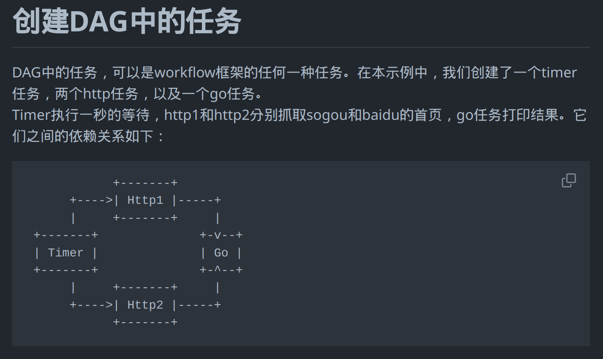
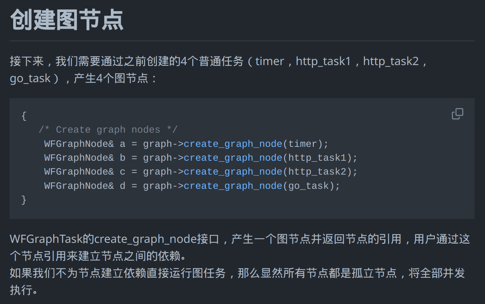
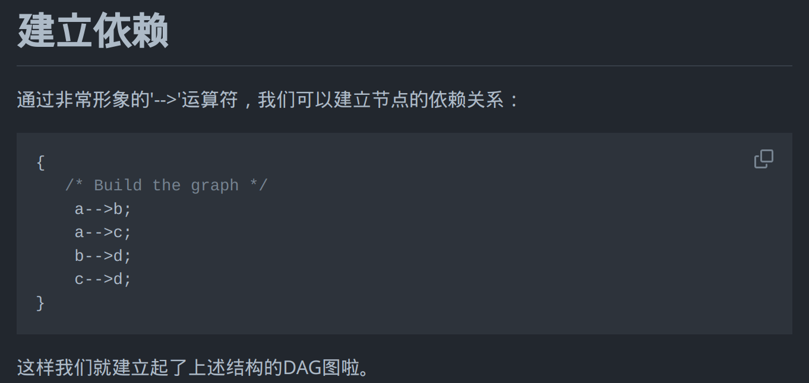
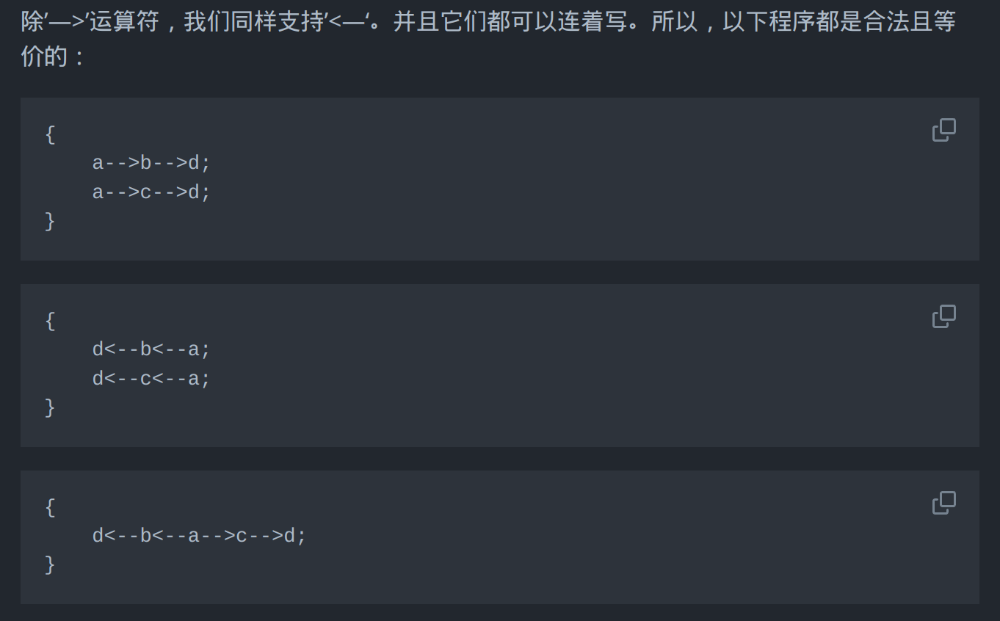
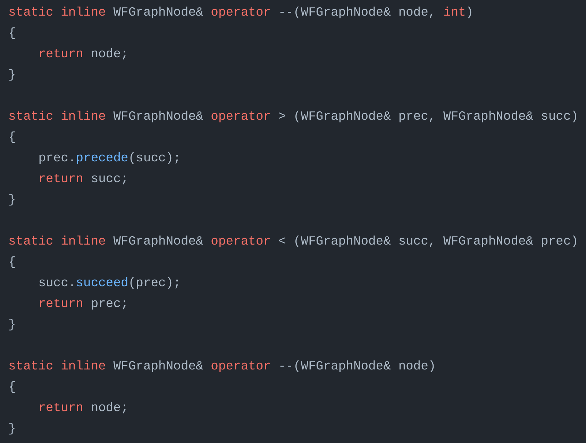

C++ 有一个非常花哨的运算符`a --> b`，它表示由`a`逐步长`-1`趋近`b`，比如下面的例子：

```cpp
#include <iostream>
int main()
{
    int x = 10;
    while (x --> 0)
        printf("%d ", x);
}
```

它的执行结果为：

```
9 8 7 6 5 4 3 2 1 0
```

而且，还可以反向书写为`b <-- a`：

```cpp
int x = 10;
while (0 <-- x)
    printf("%d ", x);
```

但是结果稍有不同，不包含最终的目标`0`：

```
9 8 7 6 5 4 3 2 1
```

咦，那我们把箭头的横线加长一点，有没有可能增加步长呢？试验一下：

```cpp
int x = 10;
while (0 <---- x)
    printf("%d ", x);
```

执行结果为：

```
8 6 4 2
```

果然，步长变为了`-2`，这说明我们可以通过改变箭头的横线来调节步长。(**注，步长调节只适用于左箭头，并不支持右箭头。**)


这样一个“渐进”运算符无疑让我们的代码更简洁明快，但是 C++ 的标准里面好像对此只字未提啊，不禁令人质疑它真的是 C++ 中原子的或者说不可分割的 token 吗？


其实所谓的“渐进”运算符并不存在，它只是一个 trick，右箭头`a --> b`其实是`(a--) > b`，左箭头`b <-- a`其实是`b < (--a)`，如此一来上文所有的行为都合理了。


所以我们也可以写出下面形式的代码：

```cpp
int x = 0;
while (x ++> 10)
    printf("%d ", x);
```

```cpp
int x = 0;
while (10 <++++++ x)
    printf("%d ", x);
```

你以为到此就完了吗？别忘了 C++ 是支持运算符重载的，而后置`++`和`>`都是可以重载的，那么我们就有的发挥了。我们看看 [workflow](https://github.com/sogou/workflow) 项目是如何鬼才地利用这一特性的：



所谓的 DAG 就是有向无环图，如下图：


然后创建了`a`,`b`,`c`,`d`四个节点：



鬼才的地方来了，它直接用`-->`实现把各个节点连接起来。。。



而且还有更加炸裂的连接方式。。。。。。



它的实现原理就是重载了几个运算符：



原理很简单，但是思路很创新。