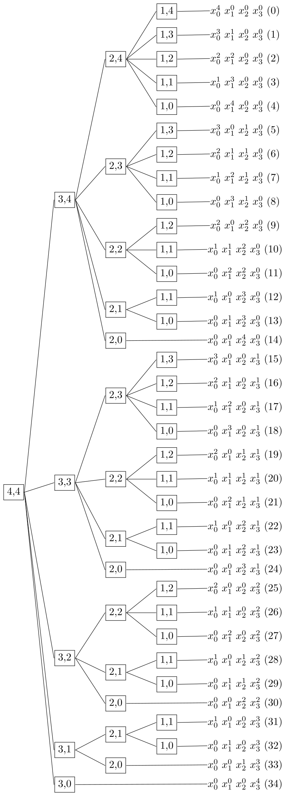

一元幂级数有着非常简单的形式：
$$
\sum_{n=0}^{\infty} a_n x^n = a_0 + a_1 x + a_2 x^2 + \cdots
$$
它非常易于编程实现，即便是两个幂级数相乘，也只是 C 语言练习题的难度水平。但是，多元幂级数的编程实现难度如何呢？以三元幂级数为例，写出它的具体形式：
$$
\begin{aligned}
& \sum_{n=0}^{\infty} a_{|\vec{r}|=n} \vec{x}^{\vec{r}} = \\
& \quad a_0 + \\
& \quad a_{10} x_1 + a_{11} x_2 + a_{12} x_3 + \\
& \quad a_{20} x^2_1 + a_{21} x_1 x_2 + a_{22} x^2_2 + a_{23} x_1 x_3 + a_{24} x_2 x_3 + a_{25} x^2_3 + \\
& \quad a_{30} x^3_1 + a_{31} x^2_1 x_2 + a_{32} x_1 x^2_2 + a_{33} x^3_2 + a_{34} x^2_1 x_3 + a_{35} x_1 x_2 x_3 + a_{36} x^2_2 x_3 + a_{37} x_1 x_3^2 + a_{38} x_2 x^2_3 + a_{39} x^3_3 + \\
& \quad \cdots
\end{aligned}
$$
仅仅写到三次项，就令人眼前一黑。随着阶次的增加，会越发难以书写和表达。这种难以表达，不仅是对于人类而言，对机器也是。如果计算两个多元幂级数相乘，更会是一团糟。

# 齐次多项式

先明确一些概念：

> 单项式，指的是由数字或字母的积组成的代数式，记为 $\vec{x}^\vec{r} = x^{r_1}_{1} x^{r_2}_{2} \dots x^{r_n}_{n}$，省略了系数，其中 $\vec{x} = [x_1 \ \dots \ x_n]$ 为变量，$\vec{r} = [r_1 \ \dots \ r_n] \in \mathbb{N}^n$  为常量。
> 
> 多项式，即若干个单项式相加组成的代数式。
> 
> 齐次多项式，即组成多项式的若干单项式具有相同的次数。变量数为 $n$、次数为 $k$ 的记作 $X_n^k$。

上述多元幂级数其实可以拆分为多个齐次多项式的和，即 $X_n^0 + X_n^1 + X_n^2 + \cdots$，所以研究多元幂级数的前提是研究齐次多项式 $X_n^k$。

我们之前探讨过变量数为 $n$、次数为 $k$ 的单项式的种类数 $N(n,k)$，并且用 Graded Reverse Lexicographical Monomial Order (GRevLex) 对其进行了排序。这些 $N(n,k)$ 个单项式的和便是变量数为 $n$、次数为 $k$ 的齐次多项式。

需要明确一点，齐次多项式里各单项式的排序是确定的，即 GRevLex，那么只要掌握了带有次序的单项式的系数，就在实质上掌握了这个齐次多项式。我们对齐次多项式的所有操作，包括数乘、乘法、幂运算等等，实质都是在操作系数。为了存储各系数，比较简单的做法是直接动态分配 $N(n,k)$ 大小的`double`类型数组，这样我们就把齐次多项式抽象成了内存里的一维数组，这是最简单也是最自然的逻辑。但是问题在于难以索引，比如索引 $x^2_1 x_3$ 对应的系数，我们需要先要执行一遍 GRevLex，获得 $x^2_1 x_3$ 对应的序号，然后根据序号取数组里存储的系数。对于需要频繁的索引系数的场景，每次都要走一遍 GRevLex 的流程，这样的开销会显得我们很呆，是难以接受的，我们必须做出一些优化。

# 多叉树

树结构可以实现方便快捷地查找。为了利用这一特性，我们需要花费一番心思把齐次多项式改造成树结构。对于 $X_n^k$，当 $n\neq0$ 且 $k\neq0$ 时，把向量 $\vec{x}$ 的最后一个元素 $x_n$ 分离出来，得到新的向量 $\vec{\hat{x}} = [x_1 \ \dots \ x_{n-1}]$。用 $\vec{\hat{x}}$ 构造齐次多项式 $X_{n-1}^k$，则：

$$
X_n^k = X_{n-1}^{k} x^0_n + X_{n-1}^{k-1} x^1_n + X_{n-1}^{k-2} x^2_n + \dots + X_{n-1}^{0} x^k_n
$$

逐代分解下去，直到 $n = 1$ 或 $k = 0$ 为止，得到的便是树状结构。

> $n = 1$ 时，齐次多项式退化为单项式，没法也没必要再分离最后一个元素，树结构到此到达末端。
>
> $k = 0$ 时，说明分离后的剩余项的次数为 0，理论上可以继续分离下去，但是实际上并没有必要，到达树的末端。

以 $n = 4$ 或 $k = 4$ 为例，可以把树结构可视化为：

惊喜地发现从上到下末节点的次序和 GRevLex 有一致性。

> 需要注意的是，在编程实现的时候，每一个子节点并不持有系数数据，而是只持有指针。

# 索引

这样一套组织严密的网络，使得我们能高效地访问系数。比如我们想索引 $x_0^2 x_1^0 x_2^1 x_3^1$ 的系数。根据分离最后一个元素的原则，分离 $x_3^1$ 后的齐次多项式为 $X_3^3$，于是我们在树结构的第二层找到了 $(4,4)$ 的子节点 $(3,3)$，它位于 $(4,4)$ 的子节点的第 1 位（从 0 计数），序号跟 $x_3$ 的次数相同。然后分离 $x_2^1$，分离后的齐次多项式为 $X_2^2$，我们在 $(3,3)$ 的子节点中的第 1 位找到了 $(2,2)$。以此类推，仅需 3 次加法（加法计算节点的偏移）即可索引到系数。这相比遍历 GRevLex 有着实质性的优化，属于用空间换时间的生动体现。我们不妨分析一下索引的时间复杂度，对于 $X_n^k$，改进前的时间复杂度为 $O(\frac{k^n}{n!})$，改进后的时间复杂度为 $O(n)$，当次数 $k$ 较大时，复杂度明显降低。

# 遍历

树的遍历一般离不开递归。写一段递归的代码遍历这棵树也比较容易。但是考虑到树的抽象原型是齐次多项式，具有一定的特殊性，有时候也不是非递归不可，比如齐次多项式的数乘，把每个系数都乘以乘数即可，这种情况下直接遍历保存着系数的数组反而效率更高，用不着递归。而且，即便递归，其实遍历到末节点的次序和 GRevLex 也是一模一样的（可以自行验证）。

# 进阶

我们在对齐次多项式的多叉树表示法进行研究时，并没有止步于此，下面是研究过程中发现的其他有意思的问题：

1. 乘法。把齐次多项式抽象成树，便于索引还只是优点当中的冰山一角，它的真正强大之处在于便于乘法的编程。
2. 一共有多少个子节点？这个结果对于子结点的动态内存分配有意义，进而也能衡量我们在空间方面付出的代价。
3. 我们建模时，思想是分离单项式的最后一个元素，如果分离第一个元素，树的结构有何改变？
4. 齐次多项式的系数一定是常数吗？在抽象代数**多项式环**的理论中，多项式的系数可以是任何数学实体。但是万变不离其宗，再复杂的表达式我们都可以通过多叉树进行高效的操作。

