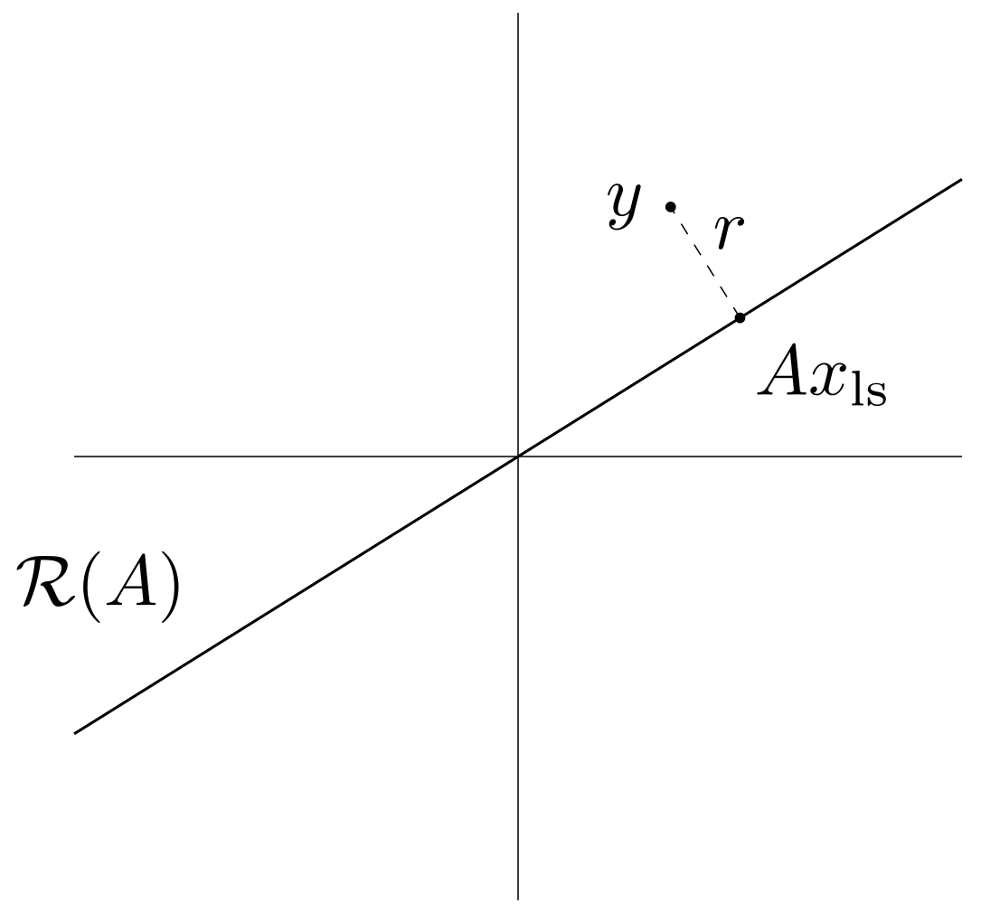
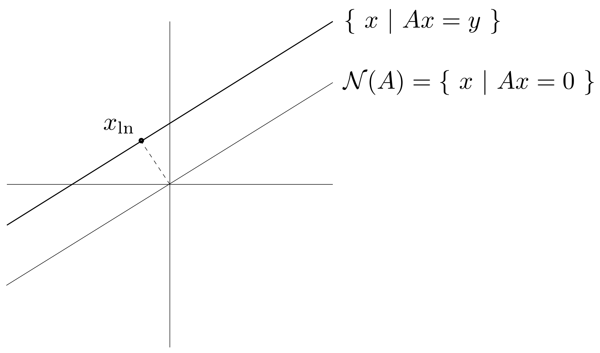

线性方程组 $A x = y$, $A \in \mathbb{R}^{m \times n}$ 的最小二乘（Least-Square）解和最小范数（Least-Norm）解有着相似的形式，容易混淆：

> Least-Square
> $$
> x = (A^T A)^{-1} A^T y
> $$
> Least-Norm
> $$
> x = A^T  (A A^T)^{-1} y
> $$

这次我们就来厘清二者的区别。

# 超定方程组与欠定方程组

超定（Overdetermined）指的是方程组（约束）的个数多于变量的个数，即 $m > n$，此时称矩阵 $A$ 为胖的（fat）。对于满秩的超定方程组，由于约束过多，自然而然无解。但是我们可以提供一个估计的解，即最小二乘解（注：最小二乘解 $x_{\text{ls}}$ 一定是不满足 $A x_{\text{ls}} = y$ 的）。

欠定（Underdetermined）指的是方程组（约束）的个数少于变量的个数，即 $m < n$，此时称矩阵 $A$ 为瘦的（skinny）。对于满秩的欠定方程组，由于约束过少，将有不止一个满足条件的解。我们可以从中挑选出最小范数解（注：最小范数解 $x_{\text{ln}}$ 一定是满足 $A x_{\text{ln}} = y$ 的）。

# 最小二乘解

由于 $A x$ 不可能等于 $y$，我们不妨定义误差：
$$
r = A x -y
$$
并寻找 $x_{\text{ls}}$ 使得 $\Vert r \Vert$ 最小。用最优化的语言描述就是：
$$
\text{minimize} \quad \Vert A x - y \Vert
$$

## 求解

> 由于 $\Vert r \Vert > 0$，寻找 $\Vert r \Vert$ 最小即寻找 $\Vert r \Vert ^2$ 最小，而
> $$
> \Vert r \Vert ^2 = (A x - y)^T (A x - y) = x^T A^T A x - 2 y^T A x + y^T y
> $$
> 它关于 $x$ 的梯度为：
> $$
> \nabla_x \Vert r \Vert ^2 = 2 A^T A x - 2 A^T y
> $$
> 于是：
> $$
> A^T A x = A^T y
> $$
> 假设 $A^T A$ 可逆，则：
> $$
> x_{\text{ls}} = (A^T A)^{-1} A^T y
> $$

## 几何解释

由于 $A$ 满秩，可以把 $A$ 的每一列看作基底，$A x$ 张成的空间记作 $\mathcal{R}(A)$。那么 $A x_{\text{ls}}$ 就是空间 $\mathcal{R}(A)$ 中距离 $y$ 最近的点（欧式距离），也可以称为 $y$ 在空间 $\mathcal{R}(A)$ 上的投影。

# 最小范数解

我们从欠定方程组的众多解当中挑选出范数最小的那个，用最优化的语言描述就是：
$$
\begin{aligned}
&\text{minimize} & x^T x \\
&\text{subject to} & A x = y
\end{aligned}
$$

## 求解

用拉格朗日乘子法进行求解：

> 构造：
> $$
> L(x, \lambda) = x^T x + \lambda^T (A x - y)
> $$
> 最优化的条件为：
> $$
> \begin{aligned}
> \nabla_x L &= 2 x + A^T \lambda = 0 \\
> \nabla_\lambda L &= A x - y = 0
> \end{aligned}
> $$
> 于是：
> $$
> x_{\text{ln}} = A^T  (A A^T)^{-1} y
> $$

## 几何解释

$x_{\text{ln}}$ 是解空间 $\{x \vert A x = y\}$ 中距离原点最近的点（欧式距离），也可以称为原点在解空间上的投影。

