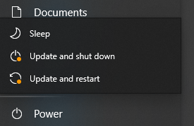
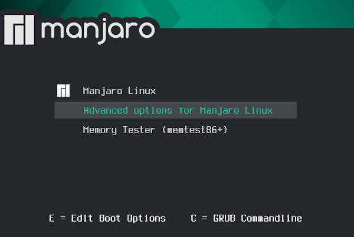

俗话说，Linux 用户不是在修 grub，就是在修 grub 的路上。

对于双系统用户，长时间没进 Windows，必然接受 Windows 不更新就不给关机的毒打。



然而，这次更新，直接把我的引导搞没了。后来我才知道，Windows 更新容易把 Linux 覆盖掉是常有的事。正常情况下，我的 Manjaro Linux 开机的引导画面类似下面这样，在这里选择 boot 进 Linux 还是 Windows。



但是，这次更新完 Windows 后，再次开机直接进入了 grub 命令行。尝试了

```
grub> reboot
```

以及

```
grub> exit
```

结果都是退出后又再次进入 grub 命令行，开始意识到出事了。懵逼了几分钟后，突然反应过来进 BIOS 看看，好在还可以在 BIOS 中更改引导顺序，把 Windows 提到最前面，退出 BIOS，成功进入 Windows。在 Windows 下检查硬盘分区，并没有损坏，`/`和`~/`目录下的文件都还在，终于松了一口。然后就是赶紧把 Linux 下重要的文件备份出来。文件抢救出来之后，最坏的结果就是重装 Linux，至少不至于令人崩溃，只不过又得重头配置一遍。

接下来的问题就是还有没有修复的可能，在查找了众多资料并且多次尝试未果后，我终于找到了一种有效的方法。

1. 首先列出所有分区：

```
grub> ls
```

对我来说，结果如下：

```
(hd0),(hd0,gpt9),(hd0,gpt8),...,(hd0,gpt1),(hd1,gpt2),(hd1,gpt1)
```

2. 然后不断尝试如下命令：

```
grub> ls (hd<X>,gpt<Y>)/
```

这里`<X>`表示硬盘的编号，`<Y>`表示分区的编号，不断尝试，直到找到 Linux `/boot`目录所在的分区，以我为例，我的`/boot`目录就在`/`目录之下，最终定位到`(hd0,gpt7)`分区。

3. 之后设置 grub 启动位置：

```
grub> set root=(hd0,gpt7)
grub> set prefix=(hd0,gpt7)/boot/grub
```

4. 设置 grub 进入正常模式：

```
grub> insmod normal
grub> normal
```

完成之后，之前丢失的引导画面就再次显示了，选择 Manjaro，成功进入。

5. 但是，如果就此结束，下次开机还会问题还会重演，所以需要在进入 Liunx 后更新和修复 grub 引导：

```bash
$ sudo update-grub
$ sudo grub-install /dev/nvme0n1
```

这里的参数`/dev/nvme0n1`是 Disk 的名称，因为前面的分区 (Device)`(hd0,gpt7)`在该物理实体下。如果不确定这个参数，可以用：

```bash
$ sudo fdisk -l
```

列出所有的 Disk 和 Device。如果是 SATA 接口的硬盘，这个参数可能是`/dev/sda`。

------

一些后话：经过多次被 Windows 坑惨之后，我认为双系统持有者，尤其是 Linux 重度用户却不得不保留 Windows 的群体，在切换到 Windows 进行演讲、在线会议等重要事项时，有必要提前一两天进入 Windows，解决好 Windows 更新，不然的话如果突然发生今天这种情况就不好了。