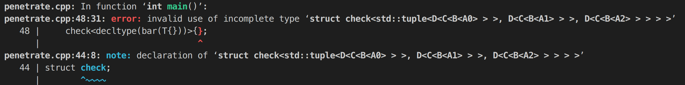

假如有这样一个需求，对于模板类`D<C<B<std::tuple<A0, A1, A2>>>>`，我们希望类模板`std::tuple`穿过其外层的尖括号，并将外层的模板映射到其每个元素之上，即得到新的模板类`std::tuple<D<C<B<A0>>>, D<C<B<A1>>>, D<C<B<A2>>>>`，如何做到？这固然可以手动实现，但我们希望编译器能完成**自动推导**，因为如果类模板`D`的外层还嵌套着`E`和`F`等等呢？我们的目标是给出一个通用的解决方案。

简便起见，我们假设类模板`D`，`C`，`B`都是空的：

```c++
template <typename Inner>
struct D {};

template <typename Inner>
struct C {};

template <typename Inner>
struct B {};
```

类`A0`，`A1`，`A2`也都是空的：

```c++
struct A0 {};
struct A1 {};
struct A2 {};
```

上述问题显然符合递归求解的思想，只不过这一次我们不再在运行时递归，而是在**编译期递归**。

为了阐述下文，我们还不得不简要介绍一下**模板的模板参数**：

> 在实例化一个模板的时候需要确定其参数，那么这个参数可以是什么呢？最容易理解的就是类型参数，也是最符合直觉的，就是司空见惯的`template <typename T>`里面的`T`。第二种是值参数，比如`std::array<double, 6>`里的常量`6`就是值参数，并且值参数严格限定为整数或枚举类型。最后一种，就是模板的参数也可以是一个模板，叫做模板的模板参数，比如对于`template <template <typename> typename T> struct X ： T<double> {};`，那么`X<std::vector>`将继承自`std::vector<double>`，而`X<std::set>`将继承自`std::set<double>`，这里无论是传`std::vector`还是`std::set`，传入的都是一个模板。总而言之，模板的参数一共有三种形式：
>
> 1. 类型
> 2. 值
> 3. 模板

懂了模板的模板参数，我们就可以尝试将`D<C<B<std::tuple<A0, A1, A2>>>>`嵌套的模板一层一层扒开：

```c++
template <template <typename> typename Outer, typename Inner>
auto foo(Outer<Inner>) -> Outer<decltype(foo(Inner{}))>
{
    return {};
}
```

上面这段代码相当之抽象，而且相较于经典 C++ 已经面目全非了。我们抽丝剥茧解读一下：

- `Outer`与`Inner`。显然`Outer`是模板的模板参数，`Inner`是模板的类型参数，我们这么做的目的就是分离出外层和内层。比如把`D<C<B<std::tuple<A0, A1, A2>>>>`传入`foo`函数，那么编译器的重载决议将把`Outer`匹配为`D`，把`Inner`匹配为`C<B<std::tuple<A0, A1, A2>>>`。
- 由于没有用到形参，所以`foo`函数的形参名缺省了，只保留了形参类型`Outer<Inner>`。
- 用到了返回值后置。（但其实不后置也完全可以，这里只是个人书写习惯，想强调返回类型是编译器推导出来的）
- 我们继续把`Inner`传入`foo`函数，以进一步地剥离，递归的“递”就体现在这里。但是`foo`函数接受的是类实例，所以我们用`Inner{}`实例化了一下。
- 我们还需要把外层模板映射到`std::tuple`每个元素之上，所以需要把`foo(Inner{})`的返回类型传入`Outer`，即递归的“归”。
- `foo(Inner{})`的返回类型需要交给编译器去推导，这里借助了关键字`decltype`。并且，`decltype`只是编译期做推导，所以无需担心`Inner{}`的开销，因为不会在运行时真的实例化它，甚至它根本就不会存在于运行时。
- 因为都是空类，直接`return {};`就好。

这段代码还缺失一个重要功能，就是递归的终止条件。显然，递归的“递”应该在`Inner`为`std::tuple<A0, A1, A2>`时终止。所以，我们需要为`foo`函数再写一个偏特化的版本：

```c++
template <template <typename> typename Outer>
auto foo(Outer<std::tuple<A0, A1, A2>>) -> Outer<A0>
{
    return {};
}
```

这样，当把`D<C<B<std::tuple<A0, A1, A2>>>>`传入`foo`函数，最终的返回类型就是`D<C<B<A0>>>`。最后，我们再为`A1`和`A2`编写类似的函数，再用`std::tuple`将三个结果整合，就解决了。

但是，这样我们需要写三个函数，加上偏特化，一共是六个，并且它们高度相似，还是没做到尽可能的复用代码，并不想就此止步。考虑到`std::tuple_element_t`可以用来萃取`std::tuple`的元素类型，于是我们有了下面的改进版：

```c++
template <int n, template <typename> typename Outer, typename Inner>
auto foo(Outer<Inner>) -> Outer<decltype(foo<n>(Inner{}))>
{
    return {};
}

template <int n, template <typename> typename Outer>
auto foo(Outer<std::tuple<A0, A1, A2>>) -> Outer<std::tuple_element_t<n, std::tuple<A0, A1, A2>>>
{
    return {};
}
```

在这个版本中，我们利用了模板函数调用可以部分指定参数的特性，将值参数`n`一层一层传下去，并在最底层提取出`std::tuple<A0, A1, A2>`的第`n`个元素类型。

最终，再用一个函数把结果们整合起来：

```c++
using T = D<C<B<std::tuple<A0, A1, A2>>>>;
auto bar(T)
{
    return std::tuple(
        foo<0>(T{}),
        foo<1>(T{}),
        foo<2>(T{})
    );
}
```

我们有两种方式来验证`bar`函数的返回类型是不是我们所期望的：

- 使用断言：

```c++
static_assert( std::is_same_v< decltype(bar(T{})), std::tuple<D<C<B<A0>>>, D<C<B<A1>>>, D<C<B<A2>>>> > );
```

这样最符合直觉，但是又回到了一开头不够通用的问题。

- 故意让编译器报错：

```c++
template <typename...>
struct check;

int main()
{
    check<decltype(bar(T{}))>{};
}
```

这是一个很妙的 trick，因为我们压根没有实现`check`类模板，编译器必然报错，而报错结果中就有我们所需的答案，做到了通用。以`g++`为例，



从报错结果中可以清楚看到我们推导成功了，我们成功地完成了模板的穿透。

------

但是，我们紧接着就得解释这么做有何意义，难道只是在玩智力游戏？而且你那些`D`，`C`，`B`都是空的，有啥现实意义啊。

实际上，模板穿透是我从一个真实的项目需求中提炼出来的，不妨就以此来解释。航天器的轨道可以由时间序列和状态序列组成。时间我们用`double`类型，状态用`std::array<double, 6>`类型，那么时间序列可以表示成`using Tlist = std::vector<double>;`，状态序列可以表示成`using Ylist = std::vector<std::array<double, 6>>;`，轨道则为`using Orbit = std::tuple<Tlist, Ylist>;`。

我们还知道 C++ 标准库有一个非常 **fancy** 且**现代**且**未来是属于它的**的工具库叫 `ranges`（太多东西想讲了，留到下次吧），它提供了诸多`views`，比如`std::ranges::reverse_view`可以逆序访问容器。我们想让`std::ranges::reverse_view<Orbit>`变成`std::tuple<std::ranges::reverse_view<Tlist>, std::ranges::reverse_view<Ylist>>`，这就需要用到模板穿透技术。

但是，我们仍然不得不再做一些声明，以免误导大家：

1. `std::tuple`是不可以直接传入`std::ranges::reverse_view`的，因为它不符合 ranges 的概念，上面那么书写只是起演示作用。在真实项目中，我们是对`Orbit`类做了容器化改造的。
2. `views`最令人拍手叫绝的正是多个`views`的灵活串联，看似跟我们的多模板嵌套恰好契合，然而我们的这个应用示例还是太理想化了，因为`std::ranges::reverse_view`恰好只接受一个参数，可惜绝大多数`views`是接受多参数的，比如`std::ranges::drop_view`和`std::ranges::stride_view`等等，它们都不适用于模板穿透。
3. `std::ranges::reverse_view`不是空类，所以`foo`函数不可以再直接`return {};`，还需要适应性改造，具体如何做就留给大家思考吧。

总之，这项技术确实没太明显的实用价值，我本人也更多地将其作为一种技术储备，但是也不能抹杀它对于逻辑的锻炼作用，尤其是对于理解**编译期递归**大有裨益。